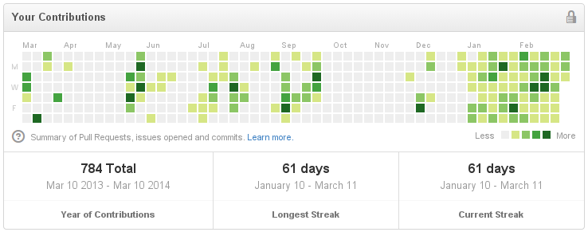

+++
title = "Разработка Мародера - 2014.03.10"
slug = "2014-03-11--devlog-marauder-002"
description = "Несколько отрядов в одной клетке, анимация атаки, флажки игроков, cogmind, c_str, byzanz, github streak, 80 символов"

[taxonomies]
tags = ["devlog", "marauder"]
+++

Ну, этот понедельник я считаю последним днем недели. Не может у меня
неделя с выходного начинаться, это неправильно как-то.

- Теперь передаю информацию о изменениях размера окна в камеру, теперь
  изображение не сжимается по высоте или ширине при изменении размеров
  окна.
- С горем пополам доделал и закомитил базовую версию поддержки
  нескольких отрядов в одной клетке. Правда, пока что выделить или
  атаковать можно только первого из них (того, что с индексом 0) и
  выделение вынесено на кнопку `S`.
- Задумался о системе слотов в клетке визуализатора.
- Еще наткнулся на блог разработки Cogmind -
  <http://www.gridsagegames.com/blog>. Выглядит офигенно, но ссылки на
  альфа версию или чего-то подобное я нигде не нашел, жалко.
- Реализовал простенькую обертку над конфигурационными файлами.
- Изменилась система сборки glfw-rs - вбил костыли в make\_deps.sh.
- Cmr сказал, что `c_str` - плохая штука. Заменил на
  `with_c_str(||{...})`
- анимации движения теперь не зависят от времени отрисовки кадра.
- И добавил поворот отряда в сторону движения.
- Исправил поворот камеры - теперь скорость вращения камеры не
  зависиот от размера экрана: что бы повернуть камеру на 360 градусов
  по горизонтали нужно двигать мышкой от левой границы окна до правой,
  не завсимо от размера окна.
- Добавил класс MoveHelper, отвечающий за передвижение от точки до
  точки со скоростью, не зависящей от количества кадров в секунду, и
  использовал его во всех визуализаторах событий.
- Удалил из визуализаторов событий методы `start` - пускай все в new
  делается.
- Добавил к анимации события атаки летящий снаряд. Ну как снаряд,
  хрень какую-то :)
- Теперь отряды принадлежат к какому-то из игроков, над отрядами
  теперь висят страшненькие флажки.
- На последок запек ambient occlusion вместо, кхм, "текстуры" "танка".
  Теперь намного лучше, как по мне.

Byzanz
======

Гуглил про выкладывание видео в бложик, наткнулся на упоминания byzanz.
Офигенно, теперь загажу все посты анимированными гифками! :)

<https://github.com/GNOME/byzanz>

Github streak
=============

И да, github streak в 61 день, еее!



80 символов хватит каждому!
===========================

Узнал про `wc -L \*.rs` для поиска самой длинной строчки в куче файлов,
прикольно.

```text
$ find src/core -name "*.rs" | xargs wc -L | sort -h
59 src/core/src/game_state.rs
59 src/core/src/player.rs
59 src/core/src/unit.rs
65 src/core/src/geom.rs
71 src/core/src/map.rs
72 src/core/src/partial_state.rs
76 src/core/src/pathfinder.rs
78 src/core/src/ai.rs
80 src/core/src/db.rs
80 src/core/src/fov.rs
83 src/core/src/dir.rs
84 src/core/src/fow.rs
91 src/core/src/internal_state.rs
93 src/core/src/filter.rs
121 src/core/src/lib.rs
121 итого
```
