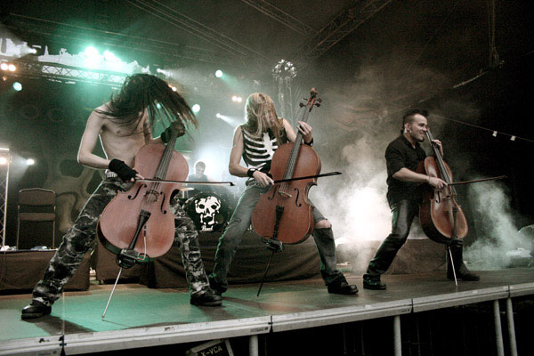
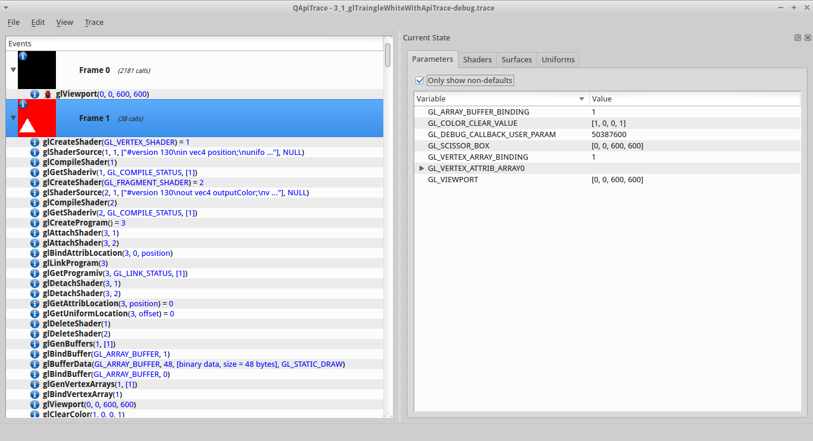

Ну что ж. За эту неделю я почти ничего не сделал, времени на Мародера
было не так уж много.

Зато сходил на концерт Апокалиптики :) .

Сделал простенькое и кривенькое перетаскивание карты средней кнопкой
мыши. Надо будет еще допиливать.

Вернулся к ковырянию шрифтов из kiss3d. Решил переписать font-stash на
Rust. Пока сделал только базовые привязки к stb\_truetype.

Все свободное время в субботу-воскресение протупил с попытками обновить
cgmath-rs под ночную сборку Ржавчины: изменения с `min\max` для чисел с
плавающей точкой.

Пробовал городить страшные вещи с макросами, но пока так и не
разобрался.

Еще потыкал qapitrace и узнал, что `gl::GetError` надо вызывать после
каждого gl-вызова.

