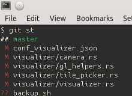

+++
title = "Разработка Мародера - 2014.03.23"
slug = "2014-03-24--devlog-marauder-004"
description = "Manowar, обновление rustc, Eq для float, мертвый страйк, выделение отдельных отрядов в клетке"
+++

Сходил на Manowar, о да, нужно больше пафоса. Только теперь вообще
ничего не слышу :) .

Мучал glfw-rs, cgmath-rs и самого мародера, что бы они собирались с
последней версией компилятора. Сложно было :)

Брендан хочет, что бы cgmath-rs был исправлен не таким грубым хаком. Там
могут быть косяки с NaN и +/-Inf. Но я туплю как сделать правильно. :(

Мой грандиозный страйк помер :(, черт:

Капельку поковырял текст. Решил, что не буду использовать cmr/hgl-rs,
страшно мне. Лучше все-таки чего-то свое сделаю.

Шрифты, шрифты:

Сделал выделение отдельных отрядов в клетке:

