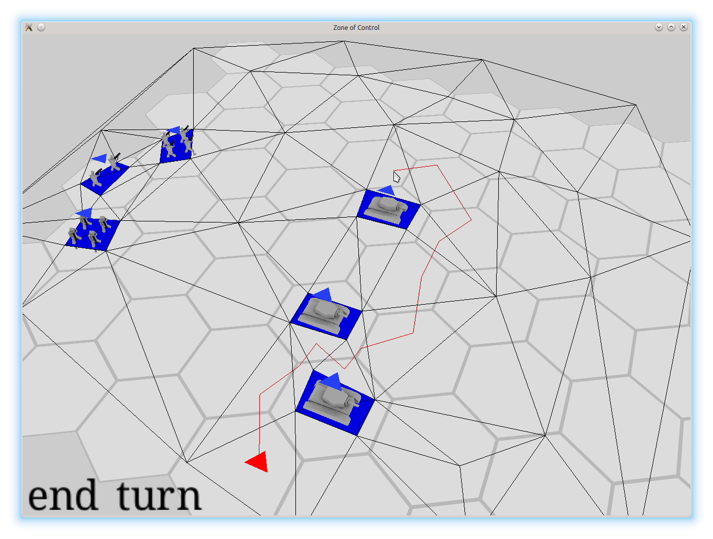
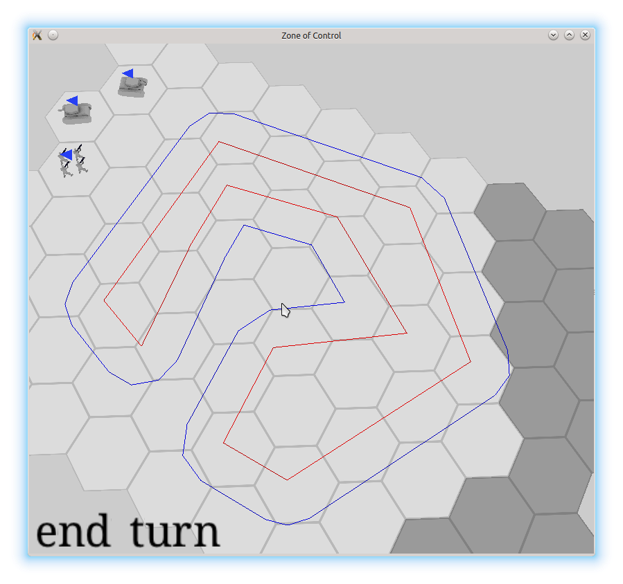

Перезапуск журнала
##################

:tags: devlog, zoc
:excerpt: Через полтора года я таки вспомнил про этот журнал

Насмотрелся я тут на журналы reangd_, cogmind_, eao197_ и всякие
другие, решил что тоже чего-нибудь хочу писать.
С последней моей попытки прошло около полутора лет)

Итак, на момент написания прошлой заметки я работал над Миром Кораблей в
`питерском wargaming.net`_.
Собственно, я успел уйти оттуда, поработать над казуалками в
`Zillion Whales`_, оттуда тоже уйти и осесть в
Протее_. Так что сейчас я ковыряю ip-телефонию и все игры теперь только
в свободное время, зато не надо каждый день "любоваться" на ужасы фритуплея)

Я больше не студент, совсем - наконец-то закончил заочку в политехе,
ура-ура! :-D 
Темой диплома как раз и был этот проект, даже презентация_ вот завалялась.
Хотя ничего особо крутого, как мне изначально хотелось, на деле не вышло.
Ключевым моментом диплома являлся ИИ. Я там подробно расписал
какие они бывают и какие виды подходят для каких игр.
А вот реализовать полноценный не успел - сдавался вариант, который только
формально можно было назвать "практичным ИИ"
(извиняюсь, но лучшего перевода для "utility-based AI" не нашел.
"ИИ, основанный на теории полезности" как-то длинновато).
Он примерял к текущему состоянию игры захардкоженные шаблоны
на основе позиций и типов отрядов, оценивал
коэффециент их полезности, и втупую применял их.
На специально подготовленных ситуациях выглядело не так и плохо,
но это отмазочный вариант, конечно. И с очень стремным кодом,
так что в git'е сейчас так и лежит
базовый "ИИ" - подъехать в на расстояние выстрела и стрелять :-| .
Но общий обыт был интересным)

Сама ржавчина, конечно, за это время сильно выросла, с 0.10 аж до 1.4.
Вместо извращений по установке зависимостей или возни с git submodules,
появился cargo.
По достижении 1.0 появилась обратная совместимость. Хотя конкретно от
этого я и не в полном восторге, руки у авторов языка теперь "полусвязаны",
но переписываний и правда стало меньше,
только когда библиотеки чего-то ломают. Да и с этим Cargo.lock очень
помогает. Хотя, я уже месяца полтора его не обновлял - ух и сложный 
же следующий ``cargo update`` у меня будет.

-----

За полтора года я успел переиграть много во что повлияевшего
на мое видение пошаговых стратегий, например:

- малоизвестная `Battle Academy 2`_ из которой я решил фактически
  передрать ядро механики для тактического режима :) - взаимодействие
  видов войск, быстрое/осторожное передвижение, хитрая видимость,
  реакционный огонь, боевой дух/подавление и т.п.;

- чуть более известная `Unity of Command`_ повлияла на мое видение
  стратегического режима - хитрая система линий снабжения, механика
  окружений и т.п.;

- мобильная Uniwar_ - классная система параллельных сетевых игр,
  а сама по себе игровая механика напоминает, что шестигранникам
  минимализм никогда не помешает;

- серия Wargame, а именно `W:AB`_ и `W:RD`_ - одна из немногих стратегий в
  реальном времени, в которую я с удовольствием поиграл за долгое время.
  Интересна своим балансом между реализмом/"веселостью" и взаимодействием
  между разными видами войск.

Много думал про пошаговые игры без клеток, все-таки у клеток много
недостатков/особенностей. Даже немного экспериментировал - сделал
простенькое путенахождение по вручную размеченной навигационной сетке:

Путь проложен по центрам треугольников, для оптимизации потом хотел
прикрутить `funnel algorithm`_, но до этого этапа не дошло.
Если что, шестигранники тут уже ничего не значат, просто
на основе работающего прилжожения экспериментировал.
Затем, написал простенький "наращиватель" препятствий, который
в зависимости от величины угла добавлял разное количество
вспомогательных отрезков:

Предполагалось, что все юниты будут поделены на несколько групп
по размерам и для каждой группы будет поддерживаться своя сетка.
Непосредственно преобразованием массива таких "жирных" препятствий в сетку
должен был заниматься триангулятор. Мне большего всего приглянулся плюсовый
poly2tri_:

.. image:: images/2015-08-11--triangulation-cpp-demo.png
    :alt: Всякие стандартные примеры из poly2tri

Даже пытался портировать его на ржавчину, но там очень стремная работа с
памятью, очень хреново укладывается в модель ржавчины.
Пробовал переделать плюсовую версию на работу с массивами и индексами,
но потом решил что очень уж много на эксперимент уходит времени, энтузиазм
про бесклеточные игры прошел, так что я совсем забросил попытку.

Ну да ладно, темы вдохновляющих игр, разных видов клеток и непрерывного
пространства достойны отдельных заметок, а эта запись и так большой
получается.

-----

Теперь, наконец-то, что касается самого проекта.

Прежде всего, он переименован из Марoдера в Зону Контроля (Zone of Control).
Сокращенно - ЗК/ZoC. Гитхабовское хранилище переехало в
https://github.com/ozkriff/zoc.

Внешний вид с момента сдачи диплома изменился слабо и выглядит все это
безобразие сейчас как-то так:

.. raw:: html

    
<iframe
        frameborder="0"
        allowfullscreen
        src="https://www.youtube.com/embed/srJAfngSwxk?color=white&rel=0&showinfo=0"
    ></iframe>

Собственно, да, я портировал это на android, хотя под линуксом и виндой тоже
должно работать.
Спасибо Skligus'y за его rusty-cardboard_, очень помогло поначалу,
и Tomaka за его glutin_ и android-rs-glue_.
К сожалению, для сборки под андроид требуется ночная сборка rustc, потому
что в android-rs-glue используются какие-то нестабильные штуки.
Хотя надо перепроверить, может уже и стабильного компилятора хватит
- ржавчина так быстро развивается :).

Кстати, да, переписал с glfw-rs на glutin_ - чем больше кода на ржавчине,
тем прощe, особенно при сборке на разных платформах.
Еще хотел со своих `костылей вокруг OpenGL`_ перейти на glium_,
но пока не осилил.

Переделал с выделения через цветовой буфер на чистую математику
- пересечение луча из курсора с плоскостью карты, бла бла блап.
Уж очень много от времени отрисоки кадра оно сжирало, да и с шейдерами
так меньше хлопот.

Но это все про техническую часть. Что касается самой игры, то:

- два захардкоженых режима на одной карте с одним набором войск
  - против тупого ИИ или хотсит на двух игроков;
- от одного до пяти членов отряда в клетке -
  отказался от идеи иметь несколько отрядов в слотах одной клетки,
  потому что так и не придумал, как это все нормально отображать
  и как этим управлять. Хотя, при введении зданий и летающих отрядов,
  наверное, придется тут усложнить ситуацию;
- до двух активных очков атаки для стрельбы по прямому приказу игрока;
- одно пассивное очко атаки для реакционного огня в чужой ход (как в x-com)
  + неиспользованные в свой ход активные очки атаки становятся пассивными;
- вероятность поражения с (пока что) захардкожеными вероятностями попадания
  в зависимости от типа атакующего, защищающегося и местности;
- кривоватый туман войны, который впоследствии, видимо, будут переведен
  на менее дискретный алгоритм;
- заготовка системы боевого духа и подавления - каждый ход
  восстанавливается 10 очков морали, за каждую атаку снимается
  по 10, если мораль падает ниже половины - отряд не может стрелять;
- разная стоимость движения по местности для разных отрядов;
- два режима передвижения - быстрый и осторожный, который стоит в два
  раза дороже, зато не накладывает штрафы на точность при стрельбе
  и при попадании под огонь отряд не лишается оставшихся очков движения;
- тестовый грузовик для транспортировки пехоты;
- механика видимости из BA2 с двумя радиусами - "нормальная" и "отличная"
  видимость. Последняя позволяет увидеть скрытые юниты (например, пехоту в лесу);
- атаки из засад, если атакующий изначально невидим, с бонусом к атаке и
  шансом не раскрыть свою позицию;
- приказ "не стрелять" для отключения реакционного огня при организации
  хитрых засад или для разведчиков;
- пока что только четыре вида отрядов:

  - пехота - четыре человека, одна клетка отличной видимости,
    умеют тихориться в лесу;
  - разведчики - как пехота, только всего 2 человека, зато видят
    и бегают немного быстрее;
  - танк - громко стреляет и толсто бронирован, зато у него вообще
    нет отличной видимости (попробуй что через щели в броне рассмотреть)
    - без пехотного прикрытия рядом с лесом ему ездить не стоит;
  - грузовик - не умеет стрелять, очень хрупкий и подслеповатый, зато
    быстрее всех остальных отрядов и может перевозить пехоту;

Ну, вот как-то так. Разработка, как видно, сильно затянулась_ - я-то хотел
такое уже через пару месяцев иметь, ха!
То ли мне просто лень, то ли времени и правда мало получается выделять,
черт его знает.
Уже мнооого раз полностью терял весь энтузиазм и забрасывал игру на
пару месяев, даже пытался чего-то другое делать.
Но потом возвращался, что бы все-таки надо довести до ума эту чертову ЗК :) .
Да и вышеупомянутые игры сильно помогали с вдохновением)

Вот, собственно, вся первая запись. Вряд ли я буду теперь пытаться делать
недельные отчеты, скорее буду писать более мелкие заметки по настроению
- регулярность вытягивает из любого дела весь интерес.
Ну и писать тут буду, наверное, не только по делу - смотрите теги :) .

.. _Протее: protei.ru
.. _питерском wargaming.net: https://wargaming.com/ru/about/our-locations/saint-petersburg
.. _Zillion Whales: http://zillionwhales.ru
.. _затянулась: http://mysweetwhomp.fr/private/119228173847/tumblr_noimn4cVks1u4yjir
.. _reangd: http://reangdblog.blogspot.com
.. _cogmind: http://www.gridsagegames.com/blog
.. _eao197: https://eao197.blogspot.ru
.. _презентация: pdfs/lesnikov_a_a_slides_2015.pdf
.. _funnel algorithm: http://digestingduck.blogspot.ru/2010/03/simple-stupid-funnel-algorithm.html
.. _poly2tri: https://code.google.com/p/poly2tri
.. _rusty-cardboard: https://github.com/skligys/rusty-cardboard
.. _glium: https://github.com/tomaka/glium
.. _glutin: https://github.com/tomaka/glutin
.. _android-rs-glue: https://github.com/tomaka/android-rs-glue
.. _`W:AB`: https://store.steampowered.com/app/222750
.. _`W:RD`: https://store.steampowered.com/app/251060
.. _Battle Academy 2: https://store.steampowered.com/app/306640
.. _Unity of Command: https://store.steampowered.com/app/218090
.. _Uniwar: https://play.google.com/store/apps/details?id=android.uniwar
.. _`костылей вокруг OpenGL`: https://github.com/ozkriff/zoc/tree/47e8f0/src/zgl/src

.. vim: set tabstop=4 shiftwidth=4 softtabstop=4 expandtab:
