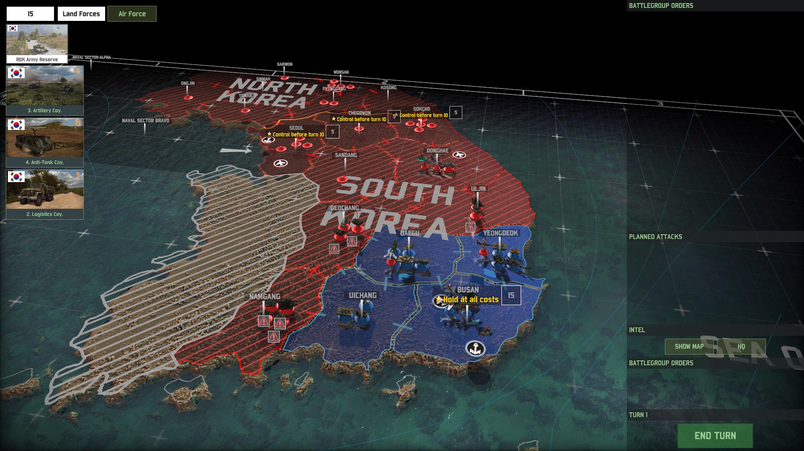
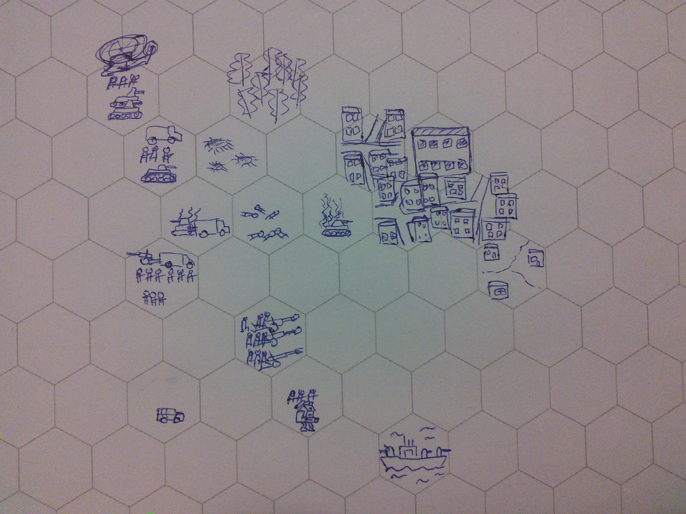
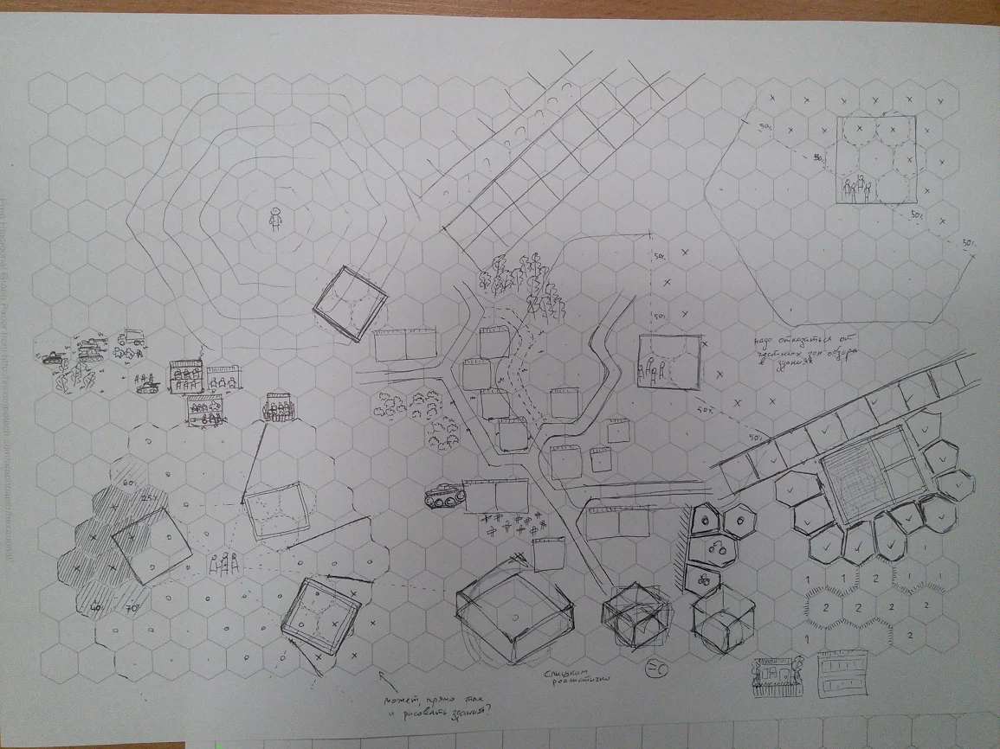
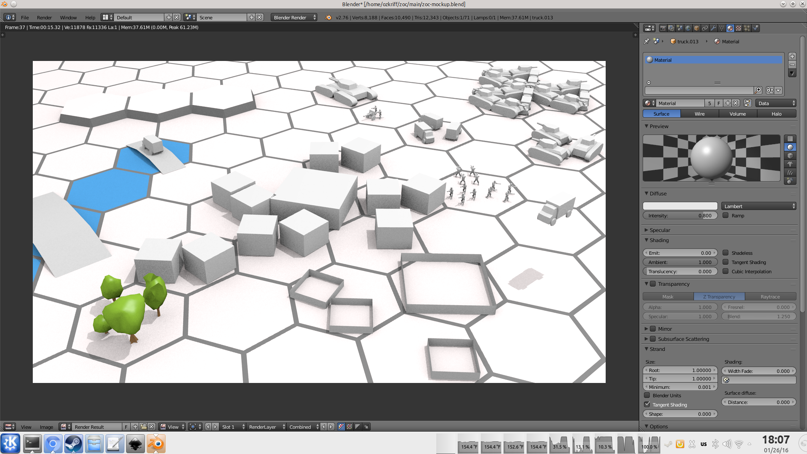

+++
title = "Мастерплан и мотивация"
slug = "2016-01-27--devlog"

[taxonomies]
tags = ["devlog", "zoc"]
+++

Знакомый скинул ссылку на вполне себе интересную
[серию статей в реддите](https://www.reddit.com/r/gamedev/comments/426148).

Хм, ну базовый цикл у меня близок к цивилизации - "Select unit, move
unit, combat/gather, repeat." у меня тоже ты "выбираешь отряд,
двигаешь/атакуешь/используешь навык, заново".

прототип - я большую часть механики беру из игры Battle Academy, так что
она уже служит начальным прототипом) Плюс, я вот сейчас "отыгрываю" игру
в блендере на макете игры. Туман войны так не симулируешь, а вот базовую
логику сражений - вполне. Так-то у меня само приложение сейчас и в
ближайшее время, как по нему и видно, на стадии прототипа -практически
никакого интерфейса, эффектов, анимацией и т.п только игровая логика,
всплывающие текстовые надписи и бааазовая визуализация.

как оно сейчас есть оно мне нравилось более-менее, но при попытке
сделать карту побольше я понял, что города выглядят страшно криво и
бесят меня вот и задумался над переделкой механики - в итоге увеличил
клетки

Те же технические моменты, типа перехода на glium, я на потом
откладываю. Собственно, главное что бы оно на андроиде работало и я мог
проверять игру на планшете - в первую очередь для тыкалок же делается.

И да, все это - тактический режим, поверх которого должен быть еще
стратегический с глобальной картой. Но с стратегическим я пока решил не
запариваться сильно, потому что тактический должен быть цельной игрой
сам по себе.

Стратегический в итоге должен как-то так выглядеть:

и определять контекст для тактических сражений.

------------------------------------------------------------------------

перехожу ко второй статье)

вчера утром знакомому уже писал свой план на ближайший месяц-два

сделать в блендере модельки-прототипы базовых видов солдат-техники,
затем изменить код игры, что бы оно поддерживало три слота, вклячить в
игру здания и дороги, затем вклячить новые виды юнитов с базовой
математикой боя для них и добавить условия победы в режиме хотсит. Что
бы в итоге в это можно было играть полноценно.

Предполагается, что это все где-то на месяц. Хочу сосредоточиться на
получении чего-то играбельного, пускай и технически убогого и вообще
схематического.

Когда это сделаю, тогда в планах сначала переход на glium, затем сетевая
игра.

А дальше план уже более размытый: добавить редактор карт,
загрузки-сохранения, кое-какие спецэффекты довести тактический режим до
вида "не очень стыдно показать обычному знакомому, который играет в
игры, но в их производстве вообще ничего не понимает" и потом начать
работать над стратегическим режимом.

Точное время на задачи я даже не буду пытаться прикинуть, все равно
долго выйдет. Думаю категориями "вот до такой стадии было бы неплохо
добраться через два месяца, это еще через месяц-другой".

"Are you disciplined enough to stay 100% productive over that amount of
time?" -гм, 100% буду время от времени забрасывать к чертям проект на
неделю-другую как на новый год) а то так с ума сойдешь) но даже в такие
перерывы я где-то в фоне все равно продолжаю думать на зоком, так что
уверен, что сам проект не брошу.

Да, наверное стоит создать суперзадачу на гитхабе "Закончить прототип
тактического режима" с более-менее детальным списком дел в масштабе
день-неделя. Постепенное проставление галочек и правда должно
мотивировать, я люблю такие штуки))

------------------------------------------------------------------------

Перехожу к третьей части, про мотивацию - важная штука)

у меня один из способов мотивировать себя - написание всего этого дела
на ржавчине) все-таки интересный язык сам по себе. клево с ним
разбираться, но и времени на это уходит сильно больше, чем если бы я
просто на плюсах написал то же самое, даже свой простенький графический
движок. Но мне так не хочется еще и в свободное время пачкать руки в
плюсах))

Хм, у меня, наверное, два больших источника вдохновения - это
стратегические игры, типа Unity of Command, Battle of the Bulge, В Тылу
Врага, Close Combat, Uniwar и т.п. Когда дело ну вообще никак не идет,
то я хотя бы на вечер забиваю на zoc совсем и сажусь как следует в
чего-нибудь стратегическое поиграть. В процессе почти всегда появляются
мысли вроде "черт, сюда бы такую-то возможность добавить, вот было бы
круто")

И еще схемки - или нарисованные на бумаге

в таком духе, я их мноооого рисую когда думаю)

или макеты в блендере, как вот который сейчас делаю потихоньку

Смотришь на это дело и сразу представляешь, как было бы клево, если бы
оно могло "ожить". Что бы вон та артиллерия могла дать залп дымовыми
перед вражеским городом, эта пехота забраться в броневики и ломануться
навстречу, а вон те танки в это время при поддержке вертолетов зашли в
бок и подавили бы с расстояния часть сил врага и блаблабла))

