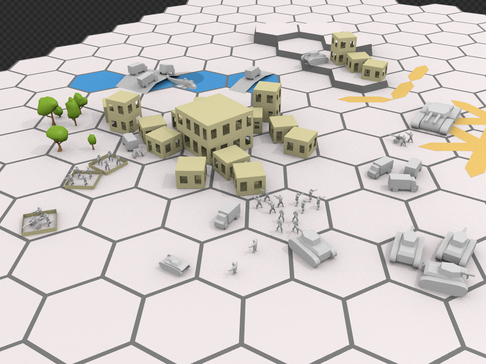
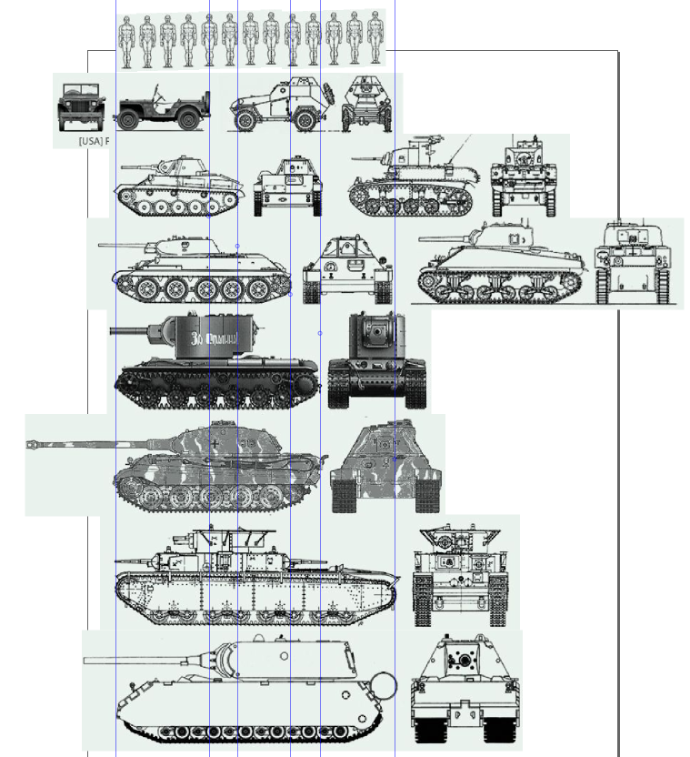
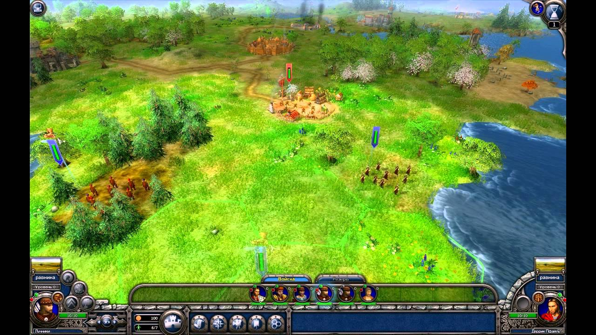
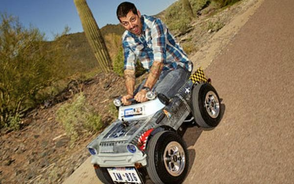
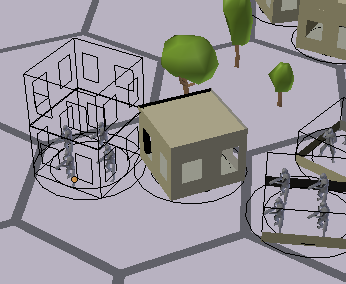

После пары просьб, решил таки
[добавить](https://github.com/ozkriff/ozkriff.github.io-src/commit/aec640)
записям желтушные заголовки. Так их и правда немного проще отличать.

------------------------------------------------------------------------

Набросал [мегазадачу](https://github.com/ozkriff/zoc/issues/159) по
расширенному прототипу тактического режима. Надеюсь, это немного поможет
не разбрасываться на всякие левые дела и просто делать пункт за пунктом.

Хотелось бы все это сделать к апрелю, за два месяца. Хе-хе, :-D ну
посмотрим, как оно выйдет. Никогда и нигде в сроки не укладывался
толком, особенно с таким размытым ТЗ.

------------------------------------------------------------------------

Двери-окна вот зданиям добавил, немного приятнее стало выглядеть,
накалякал легкий простенький танк.

Деревья кое какие сделал, вместо ворованных. Они не то что бы прям
ворованные, но под cc-by-sa, а мне хочется прям свободные-свободные
модели в составе игры иметь
([\#24](https://github.com/ozkriff/zoc/issues/24)).

Пробую накидать джип, с ним уже явно становятся видны нестыковки в
текущих размерах людей и техники. Что-то надо менять.

Изначально я хотел, что бы в один слот влезало нечто масштаба Т-35 или
маус (последние два снизу, ~10 метров).

Все-таки предполагалось, что целую клетку будут занимать только огромные
здания, заводы там всякие, а техника, если на всю клетку, то тоже должна
бы быть сопоставимой с заводом в размерах, мегатанки всякие.

Но, как из картинки видно, если придерживаться более-менее реального
размера человечков, то они становятся совсем крошечными, если камеру
прямо в землю не утыкать.

А я такое уже видел в Кодексе Войны и играть в такое очень и очень
сложно:

Но просто так взять и увеличить людей я не могу, потому что в игре
должны быть джипы, полевые пушки и т.п., где тоже используются модели
человечков и, например, джип с увеличенными людьми смотрится как-то так:

Хмм, вот я, после некоторого размышления, думаю что делать по этому
поводу:

Придется убирать требование "в слот влезает техника размера т-35/мауса
(10м)", так что в слот максимум помещается техника до 6.5м в длину (без
учета всяких торчащих пушек, черт с ними). Увеличиваю людей, допустим, в
полтора раза от реальных и увеличиваю технику в обратной пропорции к ее
размеру. Т.е. мотоцикл/полевое орудие/джип я увеличиваю ровно как и
людей, мелкие танки я увеличиваю уже на меньший процент, средние
увеличиваю совсем на чуть чуть, большие танки остаются как есть. А
всякие маусы уже в слоты не влезают и занимают сразу целую клетку и черт
уж с тем, что они размером с завод будут - еще немножко условностей БОГУ
УСЛОВНОСТЕЙ!!^W^W, кхм, в угоду визуальному удобству :).

------------------------------------------------------------------------

Я там в прошлой записи упоминал, что здания с людьми внутри должны будут
отображаться разрезанными/сеткой. Пока себе представляю как-то так:

Вопрос, конечно, как это в OpenGL все отображать =\. .obj, который пока
у меня используется, не умеет хранить просто ребра, ему нужны грани.
Менять формат пока не сильно хочется, надо сосредоточиться на прототипе.
Есть вариант, в самом блендере, в виде временного хака, какими-нибудь
модификаторами сделать вместо набора ребер набор тонких граней.

------------------------------------------------------------------------

Понял, что в блендере как-то жутко глючит выделение объектов. Погуглил,
попробовал всякое, в итоге помогло переключение режима выделения с
обычного на "Occlusion Query Based Selection". Странно это все,
неприятные мелочи)

------------------------------------------------------------------------

Вышла [четвертая
статья](https://www.reddit.com/r/gamedev/comments/433hqc) от чувака с
космической 6DOF игрой, про распределение времени. Эх, там, судя по
всему, о случае когда у тебя нет основной работы и ты просто целыми
днями делаешь игру - как не свихнуться от такого и чего-то в итоге
все-таки сделать. Не сильно мне совету оттуда подходят) Да и вообще,
слабо себе представляю, если честно, как можно решиться уйти с
постоянной работы в трушные индюшатники и только этим и жить, брр.

Залип тут на гифки в [хаброзаписи о визуализации потоков в
Go](https://habrahabr.ru/post/276255), обожаю такие картинки))

В /r/rust промелькнул приятный [пост про "try/catch/? vs
монады"](https://www.reddit.com/r/rust/comments/435572/blog_the_operator_and_try_vs_do/)
со срачем в комментариях. Клево, что не все согласились с RFC
try/catch/? обсуждения еще идут. Все-таки очень уж частное это решение,
в отличие от нормальных монад. Да, с монадами нельзя так просто
использовать return, break, continue и т.п. - ну и ладно, пускай
функциональщина будет предпочтительней императившины, я совсем не
против. В языке и так сильный уклон в эту сторону уже есть.

Внезапно
[узнал](https://github.com/blog/2100-github-pages-now-faster-and-simpler-with-jekyll-3-0),
что блогогенератор Jekyll можно вообще локально не разворачивать, а
github pages сами могут из .md исходников .html выплевывать. Как-то
совсем мимо моих ушей прошло) Ну да ладно, не буду сломя голову
переводить днявку на джекил, уже успел к пеликану более-менее
привыкнуть. Да и reStructuredText тут изначально поддерживается, мне он
больше по душе.

------------------------------------------------------------------------

Итак, по плану, на этой неделе надо закончить с набросками моделей. Надо
бы за выходные несколько видов техники еще допилить, определиться с
относительными размерами и, самое сложное, человечка со скелетом и
позами с оружием запилить. Ух, ну постараюсь :) .

