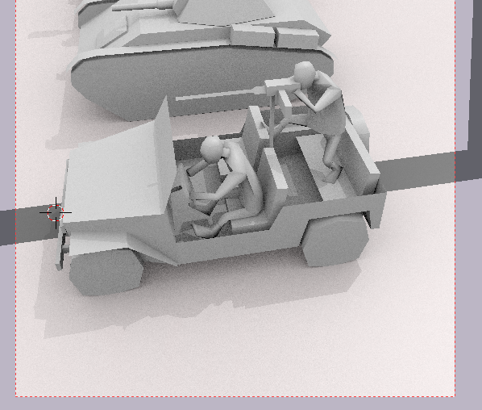

Мой план "усилием воли закончить макет за выходные" с грохотом
провалился.

(Да, картинка из xcom1, но мне лень искать с новым сектоидом)

Внезапно для меня объявился X-COM 2. И внезапно же запустился на моей
железяке, хотя все на оптимизации ругаются. Fps, правда, не на высоте
совсем.

Что могу сказать об игре после пары дней знакомства?

Пока в основном положительные эмоции, даже переделанный облик врагов
особо не раздражает.

Круто, что практически убрали миссии без таймера - хотя люди в половине
обзоров и ругаются на таймер, но мне играть стало на порядок интереснее.
Тем более, что с новой темой "мы террористы - прибежали, все раздолбали
и свалили, пока силы правопорядка не очухались" отлично сочетается.

Одна из главных вещей, за которые ругали xcom:eu -что враги ходят по
карте группами, которые надо аккуратно уничтожать по одной, и двигаться
надо странным образом, что бы случайно не активировать следующую группу.
Это же и правда глупо и скучновато было. А теперь у игрока уже не выйдет
отсидеться на месте больше двух ходов если ты на месте больше
трех-четырех ходов торчишь, то, скорее всего, вообще к цели не успеешь.

Я пока вижу один недостаток этого подхода - не та атмосфера, что была в
первой части. Тогда солдаты аккуратно прочесывали карту, как, по мнению
людей, в реальности охота на прищельцев и происходила бы, а не рвались
со всех ног через всю карту. Ну и ладно, меня новая атмосфера вполне
устраивает)

Немного раздражали несколько нелепые мечи у солдат, но к этому быстро
привыкаешь.

Еще радует, что гранаты опять можно кидать только по клеткам. Как же
много было в прошлой части раздражающих моментов, когда нужно было
терпеливо двигать мышку пикель-туда-пиксель-сюда, что бы зацепить всех
возможных врагов. Там еще и возможность гранат отскакивать накладывалась
на это безобразие. Бррр!

В обзорах игру за большое количество ошибок ругают, но у меня всего
парочка была. Один из новобранцев был без тела - голова летала сама по
себе, пришлось ему костюм поменять туда-сюда в настройках. И один раз
планшет, на котором отображается интерфейс взлома, солдат вставил внутрь
стены, за которой он прятался, и камера показывала стену. Больше ничего
не припоминаю.

Вроде мелочь, но мне почему-то очень понравилось - анимации ранений на
послемиссионном экране. Как-то компенсирует то, что во время самого
тактического боя последствий от ранений почти нет. Плюс, оправдание "они
не замечают ранений, потому что адреналин" сразу как-то правдоподобней
выглядит - вот же они после боя с ног валятся.

Видел отзывы "рандом говно, у меня подряд четыре снайпера промазали при
вероятности 80%". Вот возьми и запиши результаты всех случайностей в
игре - уверен, что получится чего-то очень близкое к честному, так что
не надо ныть.

Еще в отзывах часто мелькает: "солдаты промахиваются в упор, это тупо".
Ну хз, с моим-то обширным опытом промахиваться в упор в Red Orchestra и
всяких шутанах, у меня точно нет желания ругать бедных солдат за
подобное :) .

Из косяков могу еще отметить пикейщиков. Это враги, которые не умеют
стрелять, зато быстро бегают и хорошо бьют оглушающими дубинками. Такой
появиляется в поле зрения и на следующих ход уже будет атаковать кого-то
из твоих солдат. И если твой солдат не будет вырублен первым ударом (а в
первую треть игры такое часто случается), то он его сильно ослабит
попаданием, что упростит взятие этого солдата под контроль сектоидами.
После первой трети игры появляются варианты: снайпера натравить,
поставить на его пути своего рукопашника с "автоатакой" по всему
пробегающему рядом, взять пикейщика под контроль своими
пси-оперативниками, заминировать подходы. После середины игры он
обогащает игровой опыт однозначно. Но вначале игры появление этого врага
означает, что возможные адекватные варианты поведения игрока сильно
суживаются и это вредит игре. Вначале игры выход один - валить этих
гадов всем отрядом из всего оружия, как только увидел. Ну или я играть
не умею, тоже может быть)))

Еще жалко, что за мехов пока играть нельзя, как в xcom:ew. Жду
дополнений.

Про xcom:eu было много отзывов про оказуаливание, даже сам поначалу не
хотел играть, судил по видео с ютуба. Это уже потом, когда меня
уговорили попробовать все-таки я понял, что летсплйщики и играли на
простом уровне сложности, и там были только ранние этапы игры и
действовали они прямолинейно. От того убого и выглядело. Сейчас считаю,
что авторы очень даже круто балансируют между хардкорной и казуальной
игрой.

И да, как всегда считаю, что проходить надо в режиме "железный человек",
без всяких сохранений/загрузок))

------------------------------------------------------------------------

Так, ладно, кое-что я все-таки смог заставить себя наклепать.

Немного подпиленный легкий танк, самоходка на его основе и болванка
джипа:

Новая сетка для солдата, даже кое-какой скелет в него вставил:

Долго пытался ему размер подобрать, что бы он в технику влезал, но и
виден был. Пока вот на этом остановился.

Выдал ему винтовку:

Не удержался и немного деталей джипу добавил (теперь он смотрится
слишком детальным, когда рядом с грузовиком стоит) и пассажиров в нем
рассадил пейзажно:

Любой пулеметчик смотрится круче, если может ножку закинуть на что
угодно :) .

Средний танк с танкодесантником:

Бронетранспортеров на всех не хватит, кому-то придется так к полю боя
добираться. Заодно танк целей будет.

------------------------------------------------------------------------

Последнее время в реддите стали мелькать библиотеки шрифтовые, приятно.
Раньше думал [truetype](https://github.com/PistonDevelopers/truetype)
потыкать для замены своих костылей вокруг сишного
[stb\_truetype](https://github.com/nothings/stb/blob/master/stb_truetype.h),
теперь вот еще появился
[RustType](https://www.reddit.com/r/rust/comments/44btaz/introducing_rusttype_a_pure_rust_alternative_to).
Выглядит вполне прилично
([пример](https://github.com/dylanede/rusttype/blob/6aa3bfa/examples/simple.rs)).
Хорошо, когда есть из чего выбирать.

------------------------------------------------------------------------

Что же, в связи с xcom-катастрофой переношу цель "закончить с макетом"
на конец уже этой недели. Попробую проявиться характер и хоть немного
оторвать себя от истребления пришельцев.

