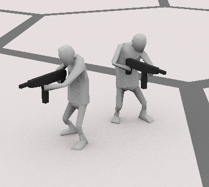
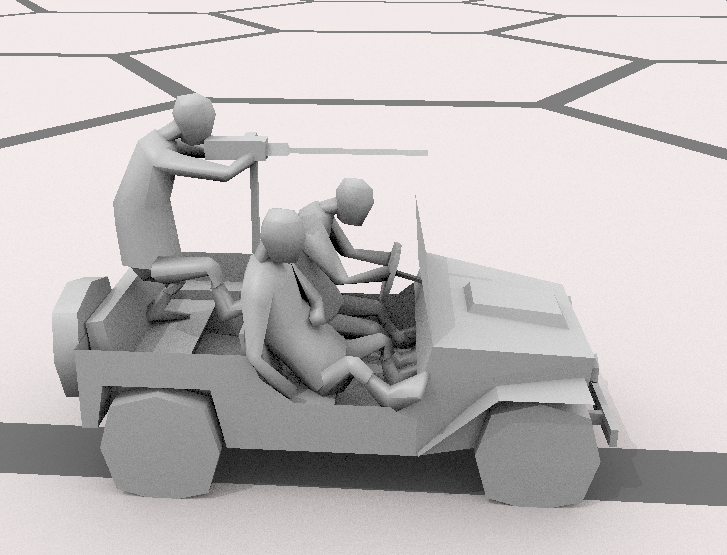
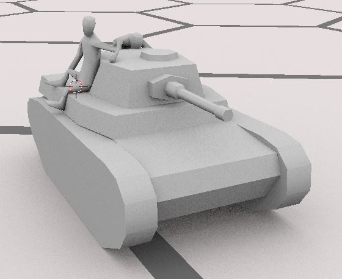
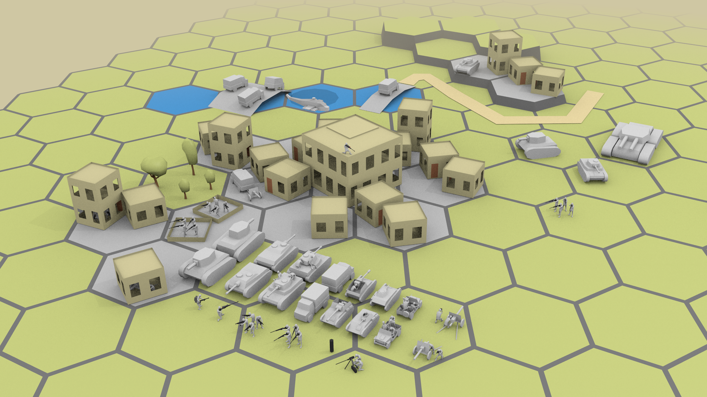

+++
title = "Чертов макет!"

[taxonomies]
tags = ["devlog", "zoc"]
+++

Ладно, X-Com меня начал потихоньку отпускать и большую часть хотелок по
макету получилось набросать.

Автоматчик:

Довольно легко визуально отличить от обычных стрелков должно быть, но на
всякий еще сгорбленными их поставил.

Закинул в джип еще одного пассажира и подкрутил позы старых:

На средний танк прилепил еще одного танкодесантника сбоку:

С виду, трех еще можно на танк посадить - как раз отряд и будет.

------------------------------------------------------------------------

Так, что тут еще на общем снимке виднеется? Огнеметчик, снайпер,
пулеметный рассчет, простенькая средняя закрытая САУ на основе среднего
танка. Обновил полевую пушку и ее прицепление к грузовику.

На планшете смотрится прилично, солдат всех различить можно.

------------------------------------------------------------------------

Все, считаю "неделю блендера" законченной - толку от дальнейшей
проработки макета уже не много, а рисовать я уже устал. Может еще
какие-то вещи буду подпиливать в нем, но уже не так целенаправленно.

Настало время писать код! Прриступаю к реализации трехслотовой системы! :-D

