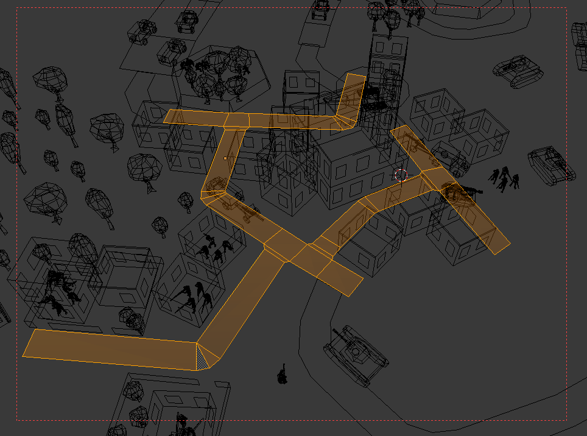
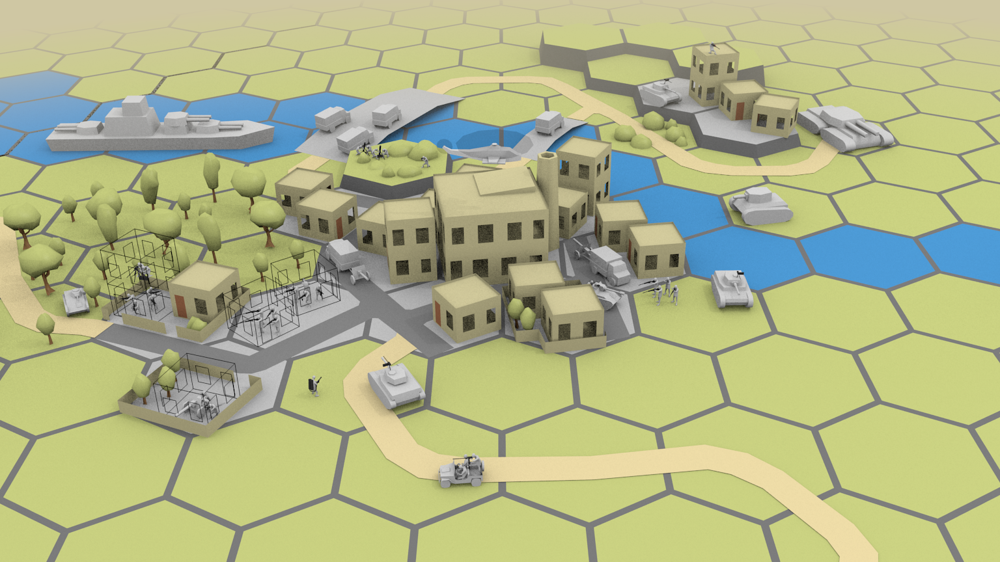

+++
title = "Градообразующие объекты"

[taxonomies]
tags = ["devlog", "zoc"]
+++

Показал нескольким знакомым макет, послушал комментарии. Один из
повторяющихся - города не выглядят городами, слишком абстрактные, больше
похожи на хаотично раскиданные детские кубики.

Я об этом не задумывался, моему замыленному взгляду город и так хорошо
виден. Даже наоборот, пытался здания раскидать и повернуть как попало,
что бы меньше чувствовалась жесткая гексагональная сетка со слотами.

По задумке, города (и деревеньки) должны занимать не больше
восьми-десяти клеток в радиусе и действительно быть довольно
абстрактными - иначе странно будет выглядеть соотношение размеров зданий
и техники/человечков. И кое-какая хаотичность в любом случае должна
быть, скучные города с улицами ровно под 90 градусов я делать совсем не
хочется.

Но в то же время города должны выглядеть как цельный многоклеточный
объект. Выход вижу в каком-то алгоритме прокладки не влияющих на логику
городских улиц и автоматическом визуальном повороте зданий не абы как, а
параллельно с улицами.

Что бы не запутаться, ввожу разделение: "дорога" - значима для игровой
логики и идет строго от центра одной клетки к центру другой, а "улица" -
это бутафорское нечто в городских клетках.

Около большого здания, наверное, стоит выравнивать мелкие здания
относительно него, а не окружающих улиц. Типа, архитектурный ансамбль :)
.

Если посмотреть на тот же атлас дорог страны, то там от столицы тянутся
федеральные трассы, пронизывающие города насквозь:

Вот желтое тут - "дороги", а белое/серое - "улицы" и дома. Наверное,
надо разрешить особую дорогу по городу прокладывать. На этих клетках
нельзя дома строить будет, но через нее будут проходить обычные улицы и
такая дорога не будет разрывать целостность города.

Хммм, еще надо будет научить отряды внутри города двигаться по улицам
(визуально, не логически).

Надо будет не забыть добавить еще железные дороги - один в один как
обычные дороги, только позволят поезду заезжать на клетку. И тропинки в
лесу: лес с деревьями, между центрами клеток нарисована небольшая дорога
с особой текстурой - по такому лесу техника сможет ехать, но медленно и
с плохим обзором.

------------------------------------------------------------------------

Но это так, мысли все. "Реально" в макете не успел все попробовать.

Добавил улицы и декоративные заборчики с садами у пары зданий.

Здания к улицам повернул "фасадами".

Заводу трубу прилепил, так чуть понятнее что это завод :) .

В таком виде улицы слишком бросаются в глаза для "чисто декоративного"
элемента. Возможно, потому что макет довольно беден на детали? В игре
можно будет их "запылить" землей по краям, думаю.

Еще вопрос, как такое автоматически генерировать можно? Тут-то сетка
вручную сделана и довольно хитрожопая:

Сделал болванку трехклеточного корабля, у этого придется немного
поколдавать с путенажодением, что бы он плавно поворачивал и только по
широким рекам мог проплывать.

------------------------------------------------------------------------

Чуууточку удалось поковырять код между рисовашками и размышлениями.

В рамках подготовки к введению системы слотов удалил костыль с
константами номеров узлов сцены
([\#154](https://github.com/ozkriff/zoc/issues/154)).

Долго пытался понять, как мой код ломает погрузку пехоты в грузовик.
Потом понял, что оно и раньше не работало. Отлично! :)

Потыкал асимметричность тумана войны
([\#149](https://github.com/ozkriff/zoc/issues/149)), не там все совсем
не просто и времени много займет, отложил пока что. Как и отложил задачи
о украшении типов-оберток
([\#120](https://github.com/ozkriff/zoc/issues/120),
[\#147](https://github.com/ozkriff/zoc/issues/147)), потому что прямой
пользы для прототипа от них не так много.

------------------------------------------------------------------------

[rust-lang/rust\#31123](https://github.com/rust-lang/rust/pull/31123) -
ураа, проверка сборок под андроидом, лед тронулся! Значит, скоро
ситуация со сборкой под андроид должна в лучшую сторону измениться.

------------------------------------------------------------------------

Заглянул тут в [обзоры](http://store.steampowered.com/app/365560) Battle
of the Bulge в стиме. Я просто в ужасе от того, сколько отрицательных
обзоров в "самых полезных". Какого черта, человеки?! Игра же отличная,
просто она отличается от большинства компьютерных стратегий. Идите в
ремейки Панзер Дженералс играть, быдлота от мира варгеймов, не портите
оценку маленькому шедевру :( .

------------------------------------------------------------------------

Итак, я опять фактически потратил пару дней на макет и размышления. Пора
уже заняться реализацией слотов в коде.

