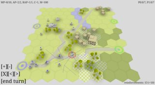

+++
title = "ZoC is dead. Long life Zemeroth."
slug = "2017-08-17--devlog"
+++

Soo, yeah, [Zone of Control](https://github.com/ozkriff/zoc) project is
officially discontinued. Sorry, friends.

^ "ZoC's dead, baby. ZoC's dead."

Why have I killed it? The primary reason is classic: I've overestimated
my resources/skills and got totally overwhelmed by the scope:

- I can't see the finish line and have no idea what exactly I can
  feature-cut. Strategic mode? Sane UI? Networking? Skeletal
  animations? Particles? Ships? Aircrafts? Tens of unit types? Oh-oh,
  I don't believe that ZoC could be really cool without any of these
  (and some others) features.

  This situation totally drained all my motivation to continue the project.

- Slot system (multiple units per tile with fixed positions) is a
  strange beast.

  1) No idea how to make some friendly user interface: two panels (for
  friends and enemies) solution is ugly, context menus are not cool
  either.

  2) Slots create problems with visual scale: infantry models are just too
  small, especially on phone’s screen.

- [Maybe I should make an FPS? No, that's stupid.](first-person.png) Ahem,
  just joking.

Another reason is that my views on what's important for strategic games
have changed in the last several years. Now I prefer
[smaller](http://keithburgun.net/videogames-are-broken-toys)
[single-player](http://keithburgun.net/the-default-number-of-players-is-one)
games with strong accent on [emergent
complexity](http://keithburgun.net/minimalism-vs-elegance).

------------------------------------------------------------------------

So, some farewell screenshots:

...And that it.

Goodbye, my old friend Zone of Control.

Zemeroth
========

There’s one great article:
["Finishing a Game"](http://makegames.tumblr.com/post/1136623767/finishing-a-game).
I have re-read it a dozen times in the last few years. In the context of
ZoC’s fail the most important part of that article is:

> Rule 14: IF YOU DO QUIT, SCALE DOWN, NOT UP
>
> Okay, sometimes it is time to call it quits. Maybe there’s just no way
> you’ll ever finish, and what you have is too big a mess to cut
> anything out. Maybe the rest of your team has quit already. My hope in
> writing this list is to help people avoid this possibility, but hey,
> maybe you’re just coming off of such a project. And sometimes... shit
> just happens.
>
> If there’s no salvaging it, at least make sure that you scale down
> your next project. It’s easy to set your sights higher and higher,
> even as your projects become less and less finished. “My SKILLS are
> improving! I’m learning from my failure,” is a common excuse. But I
> think this is why it’s important to treat finishing as a skill, too.

Sounds reasonable to me. So I need a new much less ambitious project
which still shares some of the ZoC’s core values.

I’ve spent May and June - in the heavy existential crisis - ahem,
resting and thinking about what can I make.

Here’s what I came up with:

- Random-based skirmish-level digital tabletop game;
- Single player only;
- 3-6 fighters under player’s control;
- Short game session (under an hour) and small unscrollable maps;
- Simple vector 2d graphics with just 3-5 sprites per unit;
- Reaction attacks and action’s interruption;
- Highly dynamic (lots of small unit moves as a side effect of other
  events);
- Intentionally stupid and predictable AI;

Something in between of [Banner
Saga](http://store.steampowered.com/app/237990/The_Banner_Saga),
[Hoplite](https://play.google.com/store/apps/details?id=com.magmafortress.hoplite),
[Auro](http://store.steampowered.com/app/459680/Auro_A_MonsterBumping_Adventure/)
and [Age of
Decadence](http://store.steampowered.com/app/230070/The_Age_of_Decadence/).

Initial svg mockup (based on
[my old experiments with 2d ZoC](zoc-2d-experiments.png)):

------------------------------------------------------------------------

Ok, that was just the plan. What's actually done already?

Here's the code: <https://github.com/ozkriff/zemeroth>

Right now Zemeroth looks ~ like this:

Recent "gameplay" video:

<iframe frameborder="0" allowfullscreen src="https://www.youtube.com/embed/MVt_UOnmdKI?rel=0&showinfo=0"></iframe>

What’s implemented:

- The cornerstone of the game: reaction attacks and movement interruptions;
- Basic infantry unit type;
- Hitpoints;
- Basic AI: move closer and attack;
- Some basic UI with text/image buttons and grouping.

Android is supported from the beginning of the development (as I’m
reusing ZoC’s codebase):

Zemeroth’s architecture is mostly taken from ZoC (minus the networking
and multiple game states):

Scene action system is based on cocos’s one and something I did in dead
ZoC’s dev branch:

([btw, piston has something similar](https://docs.rs/piston2d-sprite/0.36.0/sprite/enum.Animation.html))

Häte2d
======

About reusing ZoC’s codebase...

I’m a fool who don’t learn anything and totally ignored the third rule
from finishing-a-game article:

> 3\. DON’T ROLL YOUR OWN TECH IF YOU DON’T HAVE TO

Say hello to yet another Rust 2d engine: [Häte2d](https://docs.rs/hate) :-D

The name is a silly reference to [LÖVE2D framework](https://love2d.org) (just in case).

NOTE: Häte isn’t a general-purpose game engine (at least right now) and
it’s not my goal. Just a simple 2d engine for Zemeroth’s needs.

Why haven't I used ggez.rs?

Quote from reddit:

> @pwgen-n1024: have you seen
> [this](https://www.reddit.com/r/rust/comments/6mg02o/ggez_a_rust_library_to_create_good_games_easily/)?
> its a löve2d clone in rust, it might allow you to save some work.
>
> @ozkriff: Granted, I'm well aware of ggez! :-)
>
> I'm too lazy to read the docs! NIH syndrome!111 :-D
>
> Ahem... It's a cool engine and I recommend it whenever anybody asks me
> about 2d game engines, but I don't think that ggez's core values match
> my needs in Zemeroth project:
>
> - Ggez tries to mirror Löve as closely as possible but I don't
>   believe that what's good for highly dynamic Lua is equally good
>   for Rust.
> - It seems to me that ggez targets beginners and fast prototype-like
>   projects but I'm going to invest a lot of time into this project.
> - I want the engine to be much more opinionated about UI, scene,
>   etc.
> - Right now ggez uses SDL2 (and it's not easy to replace it with
>   glutin) but I really want to use cargo-apk.

Maybe I was wrong and using geez would be a good idea,
[see Icefoxen’s answer](https://www.reddit.com/r/rust/comments/6nri26//dkbqtiu/).
But so far working on Häte was fun and we’ll see what happens later.

------------------------------------------------------------------------

That’s all for today :)

In case you're wondering, here's full Imgur-devlog which I'm trying to
keep updated: <http://imgur.com/a/SMVqO>

**Discussions**:
[/r/rust](https://www.reddit.com/r/rust/comments/6uar27/zoc_is_dead_long_life_zemeroth),
[twitter](https://twitter.com/ozkriff/status/898207059862319104).
