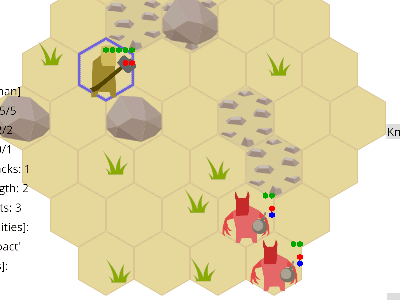

# Abilities, Lasting Effects and New Unit Types <!-- FAKE TITLE -->

<!-- TODO: use this as a title
Title: Abilities, Lasting Effects and New Unit Types
Tags: devlog, zemeroth
-->

Hi, comrades! Welcome to the third issue of Zemeroth's devlog.

[Zemeroth] is a turn-based hexagonal tactical game written in Rust.

[Zemeroth] has [6.2k LoCs][tokei] and 132🌟 now.

You can download precompiled binaries for Windows, Linux, macOS and android here:

<https://github.com/ozkriff/zemeroth/releases/tag/v0.4.0>

## Gameplay

**TODO**: embed gameplay video from youtube

## Simple walking animation ([#176])

Compare:

That's a small visual improvement but it makes game a little bit more alive.

## Unit Updates

Mega-PR. [#202]. I'm sorry. Not a good practice, I know.

Most of the units got more health and some got attacks of strength 2.

NOTE: This time I'll try to use more gifs.
[Peek] is a cool app for fast gif recording.

Every successful attack now reduces target's attack by 1.

Each ability usage requires either Attack (red) or Jokers (purple) point
and can trigger enemy's reaction attack.

### Toxic Imp

**TODO:** poison ability gif

Does no direct damage, but has a `PoisonAttack` passive ability.
Has no reaction attacks as he's dangerous enough without them)

### Imp-Bomber

Bomb damages everyone around it and knocks back them for one tile.

As Imps are stupid they can be easily damaged by that bomb.

This enemy doesn't let you to stay without moves in a good position.
But you still can sometimes move back and forth, so...

### Imp-Summoner

This unit summons so many enemies so the only your way to stay alive
is to rush and attack it while summoned imps are weak.

**Summons** ability summons three.

The plan is to make each "summon" activation more powerful:
call 2-3-4-5-6 deamons.

He's slow.
Has a lot of reaction attacks.
Can either move one tile or attack or summon during his turn.

Basically, he's your main target.

Has passive abilities `HeavyImpact` and `Regeneration`.

### Alchemist

This unit has no direct attacks.

new object: bomb + bomb_fire, bomb_poison

**TODO:** fire bomb gif

**TODO:** poison bomb gif

**Heal** ability can restore two Strength points and remove any lasting effects.

**TODO:** Heal ability gif

### Hammerman

Slow but powerful unit.

"Club" causes "Stun" lasting effect and "FlyOff".

"Knockback" does no damage. WIP ability

**TODO:** Knockback a boulder + club a bomb gif**

These abilities can be used to move bombs and boulders too.
You can push enemy into fire, poison or bomb.

Passive ability "HeavyImpact": Causes `FlyOff` effect on every hit.

### Swordsman

"Rage" ability gives three attack points.
Can be used for defence also.

Has a log cooldown time, so you need to choose carefully when to use it.

"Rage" ability gives you a lot of attacks but has a long cooldown.

"Jump" ability - think about barbarian from the Diablo.
(future versions of the ability may get stunning effect)

Two tiles distance and two turns cooldown.

**Dash** ability.
Allows you to start the attack.

**TODO:** Dash & Rage combo gif

Can be combined with Rage and Jump abilities to performs a series
of attacks and escape back to safety.

### Spearman

Also got a jump, but with a big cooldown time
and it's mostly useful for escaping

Different flavour of "Jump".

Three tiles distance and three turn cooldown.

## Implementation notes

- **New units**: imp_bomber, imp_toxic, imp_summoner, alchemist, hammerman
- **New objects**: bomb, bomb_fire, bomb_poison, poison_cloud, fire
- **Active abilities**: Knockback, Club, Jump, Poison, Bomb, BombFire, BombPoison,
    Summon, Dash, Rage, Heal
- **Auxiliary abilities**: Explode, ExplodeFire, ExplodePoison, Vanish
    (used through `Schedule` component)
- **Passive abilities**: HeavyImpact, PoisonAttack, Regenerate, Burn, Poison
- **New effects**: Create, Vanish, Stun, Heal, Knockback, Fly off, Throw
- **Lasting effects**: Poison, Stun
- **New components**: Abilities, PassiveAbilities, Effects, Schedule

TODO: describe new components and?

## Plans

- Text
- Armor
- Levels

------

That's all for today! :)

**News**: [@ozkriff on twitter](https://twitter.com/ozkriff),
[imgur devlog](imgur.com/a/SMVqO)

[Zemeroth]: https://github.com/ozkriff/zemeroth
[tokei]: https://github.com/Aaronepower/tokei
[Peek]: https://github.com/phw/peek
[#176]: https://github.com/ozkriff/zemeroth/issues/176
[#202]: https://github.com/ozkriff/zemeroth/pull/202/