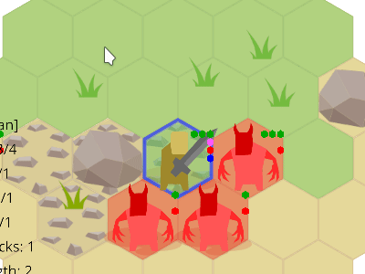

# v0.4: Abilities, Lasting Effects and New Unit Types <!-- FAKE TITLE -->

<!-- TODO: use this as a title
Title: v0.4 Abilities, Lasting Effects and New Unit Types
Tags: devlog, zemeroth
-->

Hi, comrades! I'm happy to announce [Zemeroth] v0.4.
[Zemeroth] is a turn-based hexagonal tactical game written in Rust.

You can **download precompiled binaries** for Windows, Linux, macOS and android here:
<https://github.com/ozkriff/zemeroth/releases/tag/v0.4.0>

This release adds [~2k lines of code][tokei] - a lot of new features!
And it's hard to describe all the stuff only with words and static images
so this time I'll try to use more GIFs
(btw, [Peek] is a cool app for fast gif recording).
I hope that they won't cause too many problems for the readers.

_NOTE:_ Most of the GIFs were recorded on a map of 7 tiles wide,
but the actual map is 11.
See youtube video in the middle of the article for some real gameplay.

## Simple walking animation

The first and simplest change is simple walking animations.
Compare:

That's just a small visual improvement but it makes the game
a little bit more alive.

## Gameplay Updates

### Wounds reduce attacks by one

New rule: every successful attack now reduces target's attack by 1.
It's small but important change because it increases the value of initiative
and is relied upon by many abilities.

### Strong Attacks

In the previous version all attacks were dealing 1 damage.
Now, **Swordsman** and **Hammerman** (see below) deal 2 damage points per hit.

### Abilities

Abilities is the main feature of this release.
They come in two flavours: **active** and **passive**:

- Each active ability activation requires either **Attack** (red)
    or **Joker** (purple) point and can trigger enemy's reaction attack.

    Most abilities have cooldowns of 2 or 3 turns long.

- Passive abilities don't require any action points and are activated automatically:
    during attacks or at the begining of the turn, for example.

Particular abilities are explained in unit sections below.

### New Unit: Toxic Imp

Let's start with something simple.
This enemy is similar to basic Imp, but does no direct damage
and has **Poison Attack** passive ability.

Poisoned unit receives one would at the begining of each turn.
Note that poison also takes away one attack from the victim,
weaking it even more.
Poison reduces attacks of poisoned unit by one.

Toxic Imp also has no reaction attacks as he's dangerous enough without them.

### New Unit: Imp-Bomber

Poison is cool, but it doesn't really changes the game much.
One obvious problem of v0.3 was [turtling](http://keithburgun.net/turtling) -
no movement, boring.
Reaction attacks encourage defensive playstyle.

So a new unit was added: **Imp-Bomber**.

He has an active ability **Bomb** and a very simple AI
that tries to use it, if it's aviable, and then acts as a normal Imp.
Bombs with delayed detonation is a classic way to help with this.

Bomb explodes on the next turn and damages everyone around,
knocking them back for one tile.

NOTE: As Imps are stupid they can be easily damaged by that bomb. Use it.

This enemy doesn't let you to stay without moves in a good position.
But you still can sometimes move back and forth, so...

### New Unit: Imp-Summoner

...Soo, meet **Imp-Summoner**!
This unit summons so many enemies so the only your way to stay alive
is to rush and attack him while summoned imps are still weak.

**Summon** ability creates three imps of random type.

_NOTE: Actually, the plan is to make each **summon** activation more powerful:
call 3-4-5-6 imps, to increase the pressure over time._

Anyway, this make Summoners your main target.

Summoner is slow - he can move only one tile per turn - but he has
a lot of strength (health) points and TODO

Can either move one tile or attack or summon during his turn.

Has passive abilities **Heavy Impact** and **Regeneration**.

### New Unit: Alchemist

Support unit.
Has **no direct attacks**.

Basic **Bomb** ability works the same way as it does for Imp-Bomber.

**Fire bomb** and **poison bomb** are a little bit more interesting:

Take one damage point each turn and loose one attack because of this!
Can protect your Alchemist.
Effect lasts for two turns.

Both fire and poison cloud disappear after one round.

**Heal** ability can restore two Strength points and remove any lasting effects.

### New Unit: Hammerman

Slow but powerful unit.
Attacks deal 2 damage.

"Club" ability causes "Stun" lasting effect and "FlyOff".

**Stun** ability lalala.

"Knockback" ability does no damage. WIP ability.

Passive ability "HeavyImpact": causes `FlyOff` effect on every basic attack.

These abilities can be used to move bombs and boulders too.
You can push enemy into fire, poison or bomb.
Or you can push some other your figher out of danger if it can't move.

### Updated Swordsman

"Rage" ability gives three attack points.
Can be used for defence also.

Has a log cooldown time, so you need to choose carefully when to use it.

"Rage" ability gives you a lot of attacks but has a long cooldown.

"Jump" ability - think about barbarian from the Diablo.
(future versions of the ability may get stunning effect)

Two tiles distance and two turns cooldown.

**Dash** ability allows you to
move one tile without triggering reaction attacks.
Allows you to start the attack or to escape from the enemies.

It may be hard to escape from a bad position witout `Dash` or `Jump` ability:

Can be combined with **Rage** and **Jump** abilities to perform a series
of attacks and escape back to safety.

### Updated Spearman

Also got a jump, but with a big cooldown time
and it's mostly useful for escaping

Different flavour of "Jump".

Three tiles distance and three turn cooldown.

## Gameplay Video

So, putting this all together:

**TODO**: embed gameplay video from youtube

It starts reminding something like a real game.
Though, a lot of work is still need to be done.

## Implementation notes

The post is quite long as it is, so I'm not going to describe in detail
how all this was implemented,
herese the list...

- **New units**: imp_bomber, imp_toxic, imp_summoner, alchemist, hammerman
- **New objects**: bomb, bomb_fire, bomb_poison, poison_cloud, fire
- **Active abilities**: Knockback, Club, Jump, Poison, Bomb, BombFire, BombPoison,
    Summon, Dash, Rage, Heal
- **Auxiliary abilities**: Explode, ExplodeFire, ExplodePoison, Vanish
    (only used by `Schedule` component)
- **Passive abilities**: HeavyImpact, PoisonAttack, Regenerate, Burn, Poison
- **New effects**: Create, Vanish, Stun, Heal, Knockback, Fly off, Throw
- **Lasting effects**: Poison, Stun
- **New components**: Abilities, PassiveAbilities, Effects, Schedule

TODO: describe new components and?

Bombs required `Schedule` component.

Fire and poison cloud used it too to `Vanish` themselves after a few turns.

`PassiveAbilities` component is used by Fire, Poison Cloud, Hammerman Toxic Imp
and Imp Summoner to use their Passive abilities: Heavy ...

`Poison` and `Stun` lasting effects required introduction of ...

New `Command` - UseAbility. AI knows about it because of the Imp Bomber and Imp Summoner.

Btw, [RON v0.2](https://github.com/ron-rs/ron/releases/tag/v0.2)
added extensions that allows
`unwrap_newtypes`, for example, allow to get rid of many braces

## Short-Range Plans

- Fix text issues (add link) - (show image)
- Add Armor (link):
    more interesting complexity (?)
- Battle math: all the attacks for now have 50% chance to hit and
    all the abilities have 100% chance to success.
- Win condition / levels (link):
    you kill everyone and nothing happens. Boring :)

------

That's all for today! :)

**News**: [@ozkriff on twitter](https://twitter.com/ozkriff),
[imgur devlog](imgur.com/a/SMVqO)

[Zemeroth]: https://github.com/ozkriff/zemeroth
[tokei]: https://github.com/Aaronepower/tokei
[Peek]: https://github.com/phw/peek
