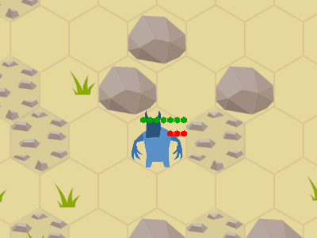
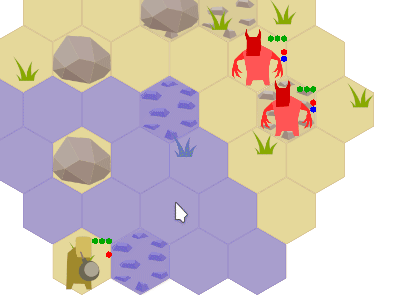
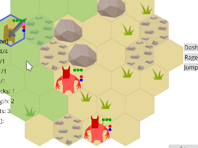
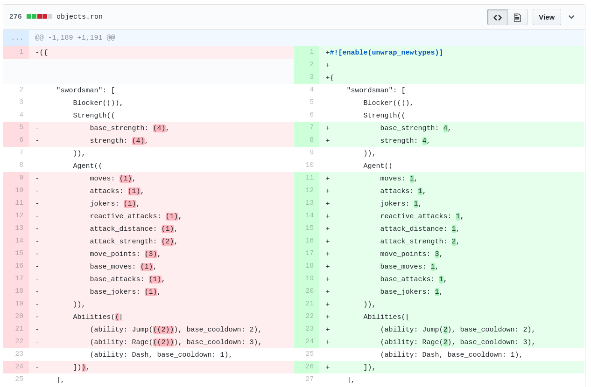
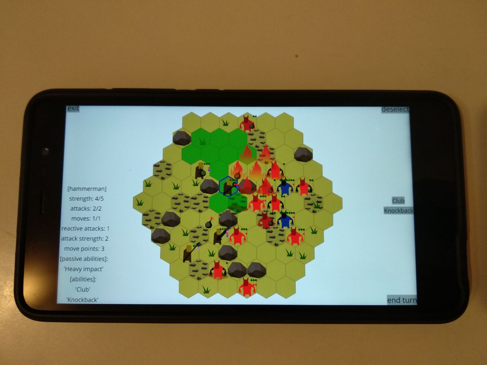

Title: Zemeroth v0.4: Abilities, Lasting Effects and New Unit Types
Tags: devlog, zemeroth

Hi, comrades! I'm happy to announce [Zemeroth] v0.4.
[Zemeroth] is a turn-based hexagonal tactical game written in Rust.

You can **download precompiled binaries** for Windows, Linux, macOS and android here:
<https://github.com/ozkriff/zemeroth/releases/tag/v0.4.0>

This release adds [~2k lines of code][tokei] - a lot of new features!
And it's hard to describe all the stuff only with words and static images
so this time I'll try to use more GIFs
(btw, [Peek] is a cool app for fast gif recording).
I hope that they won't cause too many problems for the readers.

_NOTE:_ Most of the GIFs were recorded on a map of 7 tiles wide,
but the actual map is 11.
See youtube video in the middle of the article for some real gameplay.

## Simple walking animation

The first and simplest change is simple walking animations.
Compare:

That's just a small visual improvement but it makes the game
a little bit more alive.

## Gameplay Updates

### Wounds reduce attacks by one

New rule: every successful attack now reduces target's attack by 1.
It's small but important change because it increases the value of initiative
and is relied upon by many abilities.

### Strong Attacks

In the previous version all attacks were dealing 1 damage.
Now, **Swordsman** and **Hammerman** (see below) deal 2 damage points per hit.

### Abilities

Abilities is the main feature of this release.
They come in two flavours: **active** and **passive**:

- Each active ability activation requires either **Attack** (red)
    or **Joker** (purple) point and can trigger enemy's reaction attack.

    Most abilities have cooldowns of 2 or 3 turns long.

- Passive abilities don't require any action points and are activated automatically:
    during attacks or at the begining of the turn, for example.

Particular abilities are explained in unit sections below.

### New Unit: Toxic Imp

Let's start with something simple.
This enemy is similar to basic Imp, but does no direct damage
and has **Poison Attack** passive ability.

Poisoned unit receives one would at the begining of each turn.
Note that poison also takes away one attack from the victim,
weaking it even more.
Poison reduces attacks of poisoned unit by one.

Toxic Imp also has no reaction attacks as he's dangerous enough without them.

### New Unit: Imp-Bomber

Poison is cool, but it doesn't really changes the game much.
One obvious problem of v0.3 was [turtling](http://keithburgun.net/turtling) -
no movement, boring.
Reaction attacks encourage defensive playstyle.

So a new unit was added: **Imp-Bomber**.

^ He has an active ability **Bomb** and a very simple AI
that tries to use it, if it's aviable, and then acts as a normal Imp.
Bombs with delayed detonation is a classic way to help with this.

Bomb explodes on the next turn and damages everyone around,
knocking them back for one tile.

NOTE: As Imps are stupid they can be easily damaged by that bomb. Use it.

This enemy doesn't let you to stay without moves in a good position.
But you still can sometimes move back and forth, so...

### New Unit: Imp-Summoner

...Soo, meet **Imp-Summoner**!
This unit summons so many imps so the only your way to stay alive
is to rush and attack him while summoned imps are still weak.
Summoners are your main targets.

^ **Summon** ability creates three imps of random type.

_NOTE: Actually, the plan is to make each **summon** activation even more powerful:
call 3-4-5-6 imps, to increase the pressure over time._

Summoner is slow - сan either move one tile or attack/cast during his turn -
but he has a lot of strength (health) points
and has **Heavy Impact** and **Regeneration** passive abilities:

^ **Regeneration** restores one strength point in the begining of every turn.
**Heavy Impact** throws opponents one tile away on every hit (**FlyOff** effect).

### New Unit: Alchemist

Let's move to player's new units: meet the first one - **Alchemist**.
He's a support unit and has **no direct attacks**,
but has a bunch of useful abilities.

Basic **Bomb** ability works the same way as it does for Imp-Bomber.
**Fire bomb** and **poison bomb** are a little bit more interesting:

^ **Fire** object just deals one damage point each turn
to anyone standing in the same tile
or to anyone walking through it.

^ **Poison cloud** object acts similar to fire,
but it casts **Poisoned** effects on agents.
This effects deals one point of damage each turn and lasts for two turns.

Both fire and poison cloud objects disappear after two rounds.
Note that damage from fire and poison also removes attacks from target -
this can protect your alchemist in tough situations.

Alchemist has one more useful ability:
**Heal** can restore two strength points and remove any lasting effects:

### New Unit: Hammerman

Slow but powerful unit. His attack deals 2 damage points
and he has **HeavyImpact** passive ability (same as Summoner, see above).

^ **Club** ability causes **Stun** lasting effect and **FlyOff**.

**Stun** lasting effect removes all attacks/moves/jokers
from the target for one round.

^ These abilities can be used to move bombs and boulders too.
You can push enemy into fire, poison or bomb.
Or you can push some other your figher out of danger if needed.

### Updated Swordsman

**Swordsman** also got a few updates.
His main attack now also deals two points of damage.

^ **Rage** ability gives a lot of attacks but has a long cooldown,
so you need to choose carefully when to use it.

^ **Jump** ability - think about Diablo's Barbarian
(future versions of the ability may get stunning effect ;) ).

^ **Dash** ability allows you to
move one tile without triggering reaction attacks.
Allows you to start the attack or to escape from the enemies.

It may be hard to escape from a bad position witout **Dash** or **Jump** ability:

**Dash** can be combined with **Rage** and **Jump** abilities to perform
a series of attacks and return back to safety:

### Updated Spearman

Also got a **Jump** ability, but of a different flavour:
three tiles distance and three turns cooldown.
So it's mostly useful for escaping:

## Gameplay Video

So, putting this all together:

It starts reminding something like a real game, isn't it? :)
Though a lot of work is still need to be done.

## Implementation note: RON v0.2

[RON v0.2](https://github.com/ron-rs/ron/releases/tag/v0.2)
added `unwrap_newtypes` extension that seriously simplified my config files
by getting rid of a lot of braces:

Thanks, @Torkleyy!

------

That's all for today, I have to go play [Into the Breach][itb]! :)

**News**: [@ozkriff on twitter](https://twitter.com/ozkriff),
[imgur devlog](imgur.com/a/SMVqO)

[Zemeroth]: https://github.com/ozkriff/zemeroth
[tokei]: https://github.com/Aaronepower/tokei
[Peek]: https://github.com/phw/peek
[itb]: http://store.steampowered.com/app/590380/Into_the_Breach
