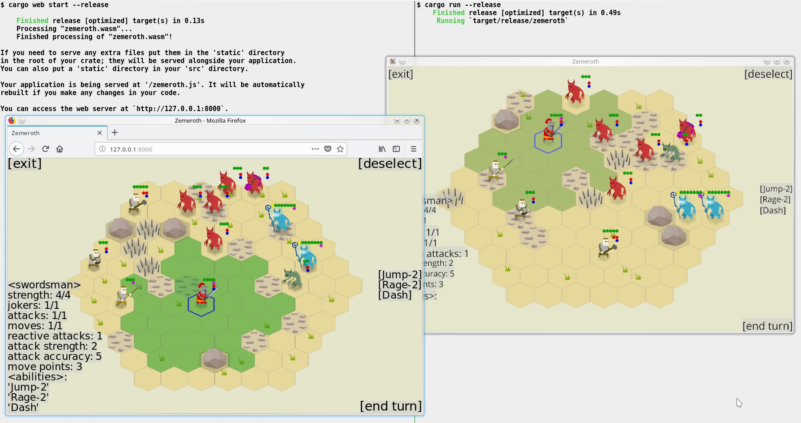

+++
title = "Zemeroth v0.5: ggez, WASM, itch.io"
TODO = "delete this file later"
+++

test test

## Migration to the `ggez` engine

Häte2d was discontinued.

<https://github.com/ozkriff/zemeroth/pull/247>

Maintaining your own engine isn't that fan in practice.
(__TODO__: add a link to `ggez`'s maintainance issues)

__TODO__: ...

- ggwp-zgui
- ggwp-zscene

`rancor` was renamed to `zcomponents`.
Btw, zcomponents crate now lives on crates.io.

No native Android version, but the web port works fine on mobile.

Debug builds are super-slow now.
I'm using nightly cargo feature to hack around this when I really need a debug build.

> RIP [Häte2d](https://docs.rs/hate), you were a fun experiment,
> but using `ggez` is much more practical.

cgmath -> nalgebra
(see [this](https://users.rust-lang.org/t/cgmath-looking-for-new-maintainers/20406))

> This PR:
>
> - kills `häte` crate :cry:
> - renames `rancor` crate to `zcomponents`
> - extracts `ggwp-zgui` and `ggwp-zscene` crates from `häte`'s dead body
> - updates some deps
> - renames `game_view` mod to `battle_view`
> - removes all android stuff (circleci config, readme info, `do_android` script,
>   Cargo.toml metadata, etc)
> - install SDL2 on CI
> - removes deployment step from CI
> - adds `time_s` helper func
> - changes bg color
> - ton of other small tweaks
>
> The most serious downside of the engine switch, though temporary,
> is that there's no Android version of the game now.

ggwp?

> "__What does `ggwp-` prefix mean?__"
>
> As Icefoxen asked to [not use `ggez-` prefix][ggwp]
> I use `ggwp-` ("good game, well played!") to denote that the crate
> belongs to `ggez` ecosystem, but is not official.

[ggwp]: https://github.com/ggez/ggez/issues/373#issuecomment-390461696

old note:

> но в целом я 90% hate'а поверх `ggez` просто реализовал,
> так что код самого проекта не так уж и сильно зацепило.
> ядро с логикой вообще не тронуто, в визуализаторе больше всего
> геморроя из-за перехода с cgmath на nalgebra :-\

Most of Hate's code was reimplemented on top of `ggez`

__TODO__: [Drawable::dimensions() #567](https://github.com/ggez/ggez/pull/567)

> [Ported Zemeroth to ggez v0.5.0-rc.0](https://github.com/ozkriff/zemeroth/pull/426),
> filed [a bunch of mostly text-related issues in the process][ggez-text-issues]
> (sorry, /u/icefoxen!) and tried to fix the most critical ones for Zemeroth:
> ["Remove the generic argument from Drawable::draw"](https://github.com/ggez/ggez/pull/559),
> ["Drawable::dimensions()"](https://github.com/ggez/ggez/pull/567) (big one!)
> and ["Fix Text::dimensions height"](https://github.com/ggez/ggez/pull/593).
>
> Now, [when ggez v0.5.0-rc.1 is out](https://www.reddit.com/r/rust_gamedev/comments/auexbj/ggez_050rc1_released),
> I can switch to it and try to
> [merge a WASM version of Zemeroth into master](https://github.com/ozkriff/zemeroth/issues/178).

[ggez-text-issues]: https://github.com/ggez/ggez/issues?utf8=%E2%9C%93&q=is%3Aissue+author%3Aozkriff+created%3A%3E2019-01-01

The most serious downside of the engine switch,
[though temporary](https://github.com/ggez/ggez/issues/70),
is that there's no Android version of the game for now.
But...

## WASM

`good-web-game` is mostly source compatible with ggez.

> Note that good-web-game is not really GGEZ's backend,
> but a separate web-targeted engine with a similar API
> that @not-fl3 uses for his prototypes.
>
> Zemeroth uses good-web-game for its web version as a quick-n-dirty
> immediate solution until a proper WASM support arrives to GGEZ
> (there're no plans of making good-web-game some kind of official GGEZ backend).
>
> The currently implemented subset of GGEZ API is quite limited
> and while it may be used for something else that Zemeroth,
> it will probably require a lot of work to do (contributions are welcome ;) ).

A hack to substitute the crate:

```rust
#[cfg(not(target_arch = "wasm32"))]
extern crate ggez;

#[cfg(target_arch = "wasm32")]
extern crate good_web_game as ggez;
```

(__TODO__: why can't I do this in `Cargo.toml`?)

```rust
#[cfg(target_arch = "wasm32")]
fn main() -> GameResult {
    ggez::start(
        conf::Conf {
            cache: conf::Cache::Index,
            loading: conf::Loading::Embedded,
            ..Default::default()
        },
        |mut context| {
            let state = MainState::new(&mut context).unwrap();
            event::run(context, state)
        },
    )
}
```

A short helper script:

```sh
$ cat utils/wasm/build.sh
#!/bin/sh
cp -r assets static
cp utils/wasm/index.html static
ls static > static/index.txt
cargo web build
```

The script prepares a `static` directory that will be packed by cargo-web.

cargo-web only packs `static` directory, so the script copies the game's assets there.

It also copies the `index.html` template page there.

And adds a good-web-game specific file that lists all resources
that should be loadable by the engine.

__TODO__: ...

[not-fl3/good-web-game](https://github.com/not-fl3/good-web-game)

[example](https://github.com/not-fl3/good-web-game/tree/9b362da6d/examples/simple)

???



## itch.io

I've created a page for Zemeroth on itch.io:
[ozkriff.itch.io/zemeroth](https://ozkriff.itch.io/zemeroth)

<https://twitter.com/ozkriff/status/1090615410242785280>

> Created [an itch.io list of Rust games][itch-rust-list].
>
> Also, I've sent a request to itch.io folks to add Rust as an instrument,
> so now a more official list is available:
> [itch.io/games/made-with-rust](https://itch.io/games/made-with-rust).
> Looks like my original list will be deprecated with time but
> it's still useful for now because only authors of the games can add
> an instrument to the metadata.

[itch-rust-list]: https://www.reddit.com/r/rust/comments/arm9dr/a_list_of_itchio_games_written_in_rust

Lot's of feedback.

> Обратной связи целый вагон, тут расписывать подробно поленюсь,
> но чаще всего повторялось, что нужен более человечный GUI,
> хоть какое-то руководство как в это играть и слишком сильный рандом -
> главное направление действий после окончания миграции на ggez 0.5 ясно.
>
> Отдельно отмечу, что отхватил на итче [огромный отзыв](https://itch.io/post/660275).
> Прям очень круто, что кто-то незнакомый продрался через супер-сырой интерфейс,
> позалипал в игру, разобрался в большей части механик,
> и не поленился написать развернутую и мотивирующую конструктивную критику.

## Hit chances

...

[Implemented hit chances](https://github.com/ozkriff/zemeroth/pull/370).
Added `attack_accuracy`  and  `dodge`  stats to  `Agent`  component
and used these fields for some basic hit chances math.

Attacks with strength > 1 have additional hit chances - with reduced damage
(each strength point gives 10% hit chance improvement).

Wounded agents become less accurate.

In the current implementation, it's based on attacker's accuracy and target's
dodge stats. The hit chance is reduced when attacker is wounded.


(__TODO__: needs an update)

> Из визуала:
>
> - При выделении готового к атаке бойца поверх врагов
>   показываются шансы попасть по ним;
> - Во время атаки под атакующим ненадолго появляется вероятность успеха атаки.
>   Нужно, в первую очередь, что бы было понятнее насколько враги опасны.
>
> Пока я два недостатка описанной выше схемы знаю:
>
> - Сходу в ней не показать оружие, у которого нет градации урона.
>   Хз что это именно за оружие должно быть и нужно ли оно мне (вряд ли),
>   но штуки вида “или попал и нанес 4 урона, или не попал совсем”
>   непредставимы без дополнительных костылей.
> - Отравляющий демон наносит 0 урона при атках - т.е. его шанс попасть
>   ниже остальных демонов.
>   Тут вбил костыль в виде повышения его точности атаки.
>
> Какие изменния случились с балансом:
>
> - Теперь первоочередная цель это ранить врага,
>   добивать уже может быть меньшим приоритетом - иногда удобно,
>   что бы практически неспособный попасть по твоим бойцам враг
>   занимал клетку и не давал его более здоровым друзьям подойти;
> - Важность способности лечения у алхимика возросла, потому что толку
>   от своих раненных бойцов становится сильно меньше.

[Show missing strength points as transparent dots](https://github.com/ozkriff/zemeroth/pull/343)
