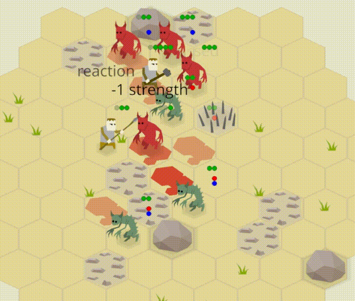

+++
title = "Zemeroth v0.5: ggez, WASM, itch.io, visuals, AI, campaign, tests"
slug = "2019-04-14--devlog-zemeroth-v0-5"
+++

<!-- markdownlint-disable MD013 -->
<!-- cspell:ignore Berserker Muton -->

Hi, folks! I'm happy to announce Zemeroth v0.5.
Main features of this release are:
migration to ggez, web version, itch.io page, campaign mode,
AI and visual updates, and tests.


[Zemeroth] is a turn-based hexagonal tactical game written in Rust.
You can [download precompiled v0.5 binaries][release v0.5]
for Windows, Linux, and macOS.
Also, now you can [play an online version][itch_zemeroth]
(_read more about it in the "WebAssembly version" section below_).


The last release happened about a year ago.
Since then the development mostly happened in irregular bursts,
sometimes it even was completely stalled for weeks.
But a year is a big period of time anyway, so there're still lots of changes.
Lots of text ahead, feel free to skip sections
that you're not interested in particularry.

[release v0.5]: https://github.com/ozkriff/zemeroth/releases/tag/v0.5.0

## Migration to the `ggez` game engine

An experiment with maintaining my own engine
(even a simple and minimalistic 2D one)
turned out to be too exhausting in practice:
you have to fight a constant stream of reports about small corner case issues
and deal with platform-specific tweaks and hacks
(stuff [like this](https://github.com/ggez/ggez/issues/587), for example).
It can consume surprisingly large amounts of time.
But what's is more important for a hobby project,
it also sucks too much fun out of the development process.

And what made it worse in my case is that [Häte2d][docs_hate] intentionally wasn't
a general-purpose game engine (to reduce the scope of work),
so it was sad to know that all this work won't be reused by anyone.
But converting Häte into a real general-purpose engine wasn't an option too,
because it wouldn't have left any time for Zemeroth's development.

So I've surrendered and decided to give away some control over
low-level parts of Zemeroth:
[Häte2d was discontinued][pr247] and replaced by [ggez], the most mature and
actively developed Rust 2d game engine at that time.


`häte` had some builtin basic
[scene management](https://docs.rs/hate/0.1.0/hate/scene/)
and [GUI](https://docs.rs/hate/0.1.0/hate/gui/) systems,
but ggez is minimalistic by design and has none of this.
(__TODO__: _what about `ggez-goodies`?_)
So, two helper crates were extracted from Häte2d and rebuilt on top of ggez:

- [ggwp-zscene](https://github.com/ozkriff/zemeroth/tree/721ad06a6/ggwp-zscene)
  is a simple scene/declarative animation manager that provides:
  - Sprites with shared data;
  - Scene and Actions to manipulate sprites;
  - Simple layers;
- [ggwp-zgui](https://github.com/ozkriff/zemeroth/tree/721ad06a6/ggwp-zgui)
  is a tiny and opinionated UI library:
  - Provides only simple labels, buttons and layouts;
  - Handles only basic click event;
  - No custom styles, only the basic one.

Since Icefoxen [asked not to use `ggez-` prefix][ggwp],
I used `ggwp-` ("good game, well played!") to denote that the crate
belongs to ggez's ecosystem, but is not official.

Not sure how helpful these libraries can be for a non-Zemeroth project.
They're still tied to Zemeroth.
You probably won't be able to use them without changes in other games.
For example, scene have no scrolling.

These crates are still immature and aren't published on crates.io yet,
while the `rancor` component library was renamed to `zcomponents` and
[is published](https://crates.io/crates/zcomponents).

------

Initially I migrated to ggez v0.4 that was SDL2-based.
But as soon as the first release candidate of [winit]-based ggez v0.5
became available I attempted to migrate to it.
I've filed [a bunch of mostly text-related issues in the process][ggez_issues]
and tried to fix the most critical ones for Zemeroth:
["Remove the generic argument from Drawable::draw"](https://github.com/ggez/ggez/pull/559),
["Drawable::dimensions()"](https://github.com/ggez/ggez/pull/567) (big one!)
and ["Fix Text::dimensions height"](https://github.com/ggez/ggez/pull/593).
These PRs took some time, but then I relatively easy
[ported Zemeroth to ggez v0.5.0-rc.0](https://github.com/ozkriff/zemeroth/pull/426).

ggez v0.5 isn't released yet, so at the moment
Zemeroth uses ggez `0.5.0-rc.1`. It's stable enough for me.

Previously I was using cgmath (because it's simple and straightforward).
ggez's "native" math library is nalgebra.
even though ggez v0.5 uses `mint` types for all its public API,
I still migrated to nalgebra, because
of [this](https://users.rust-lang.org/t/cgmath-looking-for-new-maintainers/20406).

One downside of the migration is that debug builds are much slower now,
because more code is pure Rust.
Something like 3-5 FPS on my notebook.
But it's ok, I don't need debug builds often,
I prefer debugging through logs anyway.
And even when I really need a debug build to track down something extremely strange,
I can use cargo's yet unstable feature
["profile-overrides" unstable feature][profile_overrides].

```toml
cargo-features = ["profile-overrides"]

[profile.dev.overrides."*"]
opt-level = 2
```

Another serious downside of the engine switch,
[though temporary](https://github.com/ggez/ggez/issues/70),
is that there's no native Android version of the game for now.
But who really needs a native port when you have...

[pr247]: https://github.com/ozkriff/zemeroth/pull/247
[ggez]: https://github.com/ggez/ggez
[docs_hate]: https://docs.rs/hate
[ggwp]: https://github.com/ggez/ggez/issues/373
[winit]: https://github.com/rust-windowing/winit
[mint]: https://github.com/kvark/mint
[ggez_issues]: https://github.com/ggez/ggez/issues?q=is%3Aissue+author%3Aozkriff+created%3A%3E2019-01-01
[profile_overrides]: https://doc.rust-lang.org/nightly/cargo/reference/unstable.html#profile-overrides

## WebAssembly version

After ggez v0.5-rc.0 was published, Icefoxen have posted
["The State Of GGEZ 2019"](https://wiki.alopex.li/TheStateOfGGEZ2019),
where among other things he wrote that
it will take a long time to port ggez to the web,
because a lot of issues in dependencies need to be fixed first.
(__TODO__: "a web port is unlikely to happen soon because ...")
It could be relatively easy to write a specialized web backend for ggez,
but ggez's philosophy is against having multiple backends.

And that's where [Fedor @not-fl3](https://twitter.com/notfl3) suddenly comes in
with his [good-web-game][good_web_game] WASM/WebGL game engine.

He had been experimenting with 2d web prototypes
([like this one](https://twitter.com/notfl3/status/1079499336243965952))
for some time and used a custom 2d web engine for this.
The API of this engine was heavily inspired by ggez
so it was relatively easy to create a partly ggez-compatible wrapper.

. . .

[](2019-01-29--web-port-vs-native.jpg)

`good-web-game` is mostly source compatible with ggez.

> Note that good-web-game is not really GGEZ's backend,
> but a separate web-targeted engine with a similar API
> that @not-fl3 uses for his prototypes.
>
> Zemeroth uses good-web-game for its web version as a quick-n-dirty
> immediate solution until a proper WASM support arrives to GGEZ
> (there're no plans of making good-web-game some kind of official GGEZ backend).
>
> The currently implemented subset of GGEZ API is quite limited
> and while it may be used for something else that Zemeroth,
> it will probably require a lot of work to do (contributions are welcome ;) ).

@not-fl3 haven't coded this engine from scratch, of course,
it's a result of his experiments with 2d web prototypes,
like [this one](https://twitter.com/notfl3/status/1079499336243965952).

------

You can't use crate renaming in `Cargo.toml` to reuse a name on different platforms,

```toml
# Cargo.toml with this dependencies wouldn't build:

[target.'cfg(not(target_arch = "wasm32"))'.dependencies]
ggez = "0.5.0-rc.1"

[target.'cfg(target_arch = "wasm32")'.dependencies]
ggez = { git = "https://github.com/not-fl3/good-web-game", package = "good-web-game" }
```

So the crate substitution hack is done in `main.rs` using `extern crate` items:

```rust
#[cfg(not(target_arch = "wasm32"))]
extern crate ggez;

#[cfg(target_arch = "wasm32")]
extern crate good_web_game as ggez;
```

Also, I had to use a separate main, because good-web-game
has a different initialization API:

```rust
#[cfg(target_arch = "wasm32")]
fn main() -> GameResult {
    ggez::start(
        conf::Conf {
            cache: conf::Cache::Index,
            loading: conf::Loading::Embedded,
            ..Default::default()
        },
        |mut context| {
            let state = MainState::new(&mut context).unwrap();
            event::run(context, state)
        },
    )
}
```

A short helper script was added:

```sh
$ cat utils/wasm/build.sh
#!/bin/sh
cp -r assets static
cp utils/wasm/index.html static
ls static > static/index.txt
cargo web build
```

- cargo-web only packs `static` directory (it's hardcoded),
  so the script copies the game's assets there;
- It also copies the `index.html` template page there;
- And adds a good-web-game specific file that lists all resources
  that should be loadable by the engine
  (`conf::Loading::Embedded` in the code above).

__TODO__: ...

[example](https://github.com/not-fl3/good-web-game/tree/9b362da6d/examples/simple)

Note a "enter fullscreen" button in the bottom right corner
of the game window:


As I've said, the web version of the game seems to work fine
on most mobile devices:

(_**TODO: a photo of my phone running a web version of Zemeroth**_)

[good_web_game]: https://github.com/not-fl3/good-web-game

## itch.io

I've created a page for Zemeroth on itch.io:
[ozkriff.itch.io/zemeroth][itch_zemeroth]

<https://twitter.com/ozkriff/status/1090615410242785280>

> Created [an itch.io list of Rust games][itch_rust_list].
>
> Also, I've sent a request to itch.io folks to add Rust as an instrument,
> so now a more official list is available:
> [itch.io/games/made-with-rust](https://itch.io/games/made-with-rust).
> Looks like my original list will be deprecated with time but
> it's still useful for now because only authors of the games can add
> an instrument to the metadata.

Lots of feedback.

Btw, I've also created [an itch.io page for Zone of Control][itch_zoc].

[itch_rust_list]: https://www.reddit.com/r/rust/comments/arm9dr/a_list_of_itchio_games_written_in_rust
[itch_zoc]: https://ozkriff.itch.io/zoc

## Visual Improvements

Flatten map a little bit and added some shadows

------

Dust effect (jumps) - <https://github.com/ozkriff/zemeroth/pull/390>

<!-- spell-checker:disable -->

> пыль создается одной не очень большой функцией, которая просто создает
> пачку спрайтов и навешивает на них цепочки простых действий перемещения
> и изменения цвета.

<!-- spell-checker:enable -->

------

blood splatters and weapon flashes - <https://github.com/ozkriff/zemeroth/pull/401>

Adds weapon flashes of four types: slash, smash, pierce and claw;
Adds directed dynamic blood splatters.

------

Every agent now has `WeaponType`:

- smash
- slash
- pierce
- claw

For now they are just a visual information.
They affect only what sprite is used during the attack animation.

<!-- TODO: spell-checker:disable -->

> Добавил бойцам параметр WeaponType.
> Пока есть четыре вида: smash, slash, pierce и claw
> и они чисто визуальные - для выбора подходящей текстурки.
> Некоторые спрайты атаки под углами смотрятся странно
> (копейщик, я на тебя смотрю) надо будет потом дополнительные варианты
> добавить и зеркалировать все это хозяйство по ситуации.

(__TODO__: это было в реддите или на гитхабе на английском)

<!-- TODO: spell-checker:enable -->

------

Blood splatters.
slowly dissapear in three turns.

Initial draft of the new sprites looked like this:


^ _yeah, Floating Eye and Insecto-snake haven't made it to the master yet._

_Shadows_?

<!-- TODO: spell-checker:disable -->

> На макетах выше видно много градиентов. В текущей версии решил отказаться
> от градиентов и всех округлостей, делая акцент на “типа-низкополигональном”
> угловатом стиле. На данный момент игра выглядит вот так: __TODO__.

<!-- TODO: spell-checker:enable -->

## Simple campaign mode

"Basic campaign mode with a carryover of the survivor fighters"

<!-- TODO: spell-checker:disable -->

> Представляет из себя просто цепочку боев с заранее заданными сценариями.
> Если проигрываешь в бою - все, кампания для тебя закончилась, начинай сначала.
> Если выигрываешь, то тебе показывается переходный экран со списком погибших,
> текущим составом группы и вариантами кого ты можешь “докупить” в награду.
>
> Поскольку экран боя создается в экране главного меню или экране кампании,
> а затем складывается в виде типаж-объекта на стек экранов,
> возврат результата боя получилось организовать только через [канал](__TODO__).
> Немного костыльно, но сойдет.
>
> Сейчас есть косяк с тем что если бой пошел неудачно,
> то можно в любой момент выйти из него в меню кампании и начать бой заново.
> Уже завел [задачу](https://github.com/ozkriff/zemeroth/issues/387)
> на то, что бы пресечь это безобразие - “вечная смерть” наше все.

<!-- TODO: spell-checker:enable -->

Win and Loose screens.


> Still working on a campaign mode with a carryover of the fighters
> from one battle to the next.

[campaign_01.ron](https://github.com/ozkriff/zemeroth_assets/blob/acd9fe9ef/campaign_01.ron)

------

__TODO__: Not sure if this piece belongs to this section:

<!-- TODO: spell-checker:disable -->

> <https://github.com/ozkriff/zemeroth/pull/360>
>
> <https://github.com/ozkriff/zemeroth/pull/369>
>
> Добавлены зоны начального построения (lines) и генератор
> больше не создает агентов в упор к врагам.
>
> С последним все просто - если рядом с клеткой стоит враг,
> то она считается непригодной для начальной позиции.
> Это помогает избежать дурацких ситуаций на первом ходу,
> например когда важный дальнобойный боец оказывается по случайности
> связан рукопашныи боем - теперь всегда есть возможность его отвести
> куда-то и перегруппироваться.
>
> А насчет зон, добавлено перечисление
> `pub enum Line { Any, Front, Middle, Back },`
> позволяющее указывать в сценарии где мы какие виды агентов хотим видить.
> Теперь демоны-вызываетли всегда сощдаются в дальнем конце карты за жвым щитом,
> т.е. застрахованы от быстрой расправы на первом ходу.
>
> Снимок тестовой карты, в которую специально нагнана прям куча демонов что бы
> четко были видны зоны и отступы: ...

<!-- TODO: spell-checker:enable -->

## Hit chances

[Implemented hit chances](https://github.com/ozkriff/zemeroth/pull/370).
Added `attack_accuracy`  and  `dodge`  stats to  `Agent`  component
and used these fields for some basic hit chances math.

Attacks with strength > 1 have additional hit chances - with reduced damage
(each strength point gives 10% hit chance improvement).

Wounded agents become less accurate.

In the current implementation, it's based on attacker's accuracy and target's
dodge stats. The hit chance is reduced when attacker is wounded.


(__TODO__: needs an update)

<!-- TODO: spell-checker:disable -->

> Из визуала:
>
> - При выделении готового к атаке бойца поверх врагов
>   показываются шансы попасть по ним;
> - Во время атаки под атакующим ненадолго появляется вероятность успеха атаки.
>   Нужно, в первую очередь, что бы было понятнее насколько враги опасны.
>
> Пока я два недостатка описанной выше схемы знаю:
>
> - Сходу в ней не показать оружие, у которого нет градации урона.
>   Хз что это именно за оружие должно быть и нужно ли оно мне (вряд ли),
>   но штуки вида “или попал и нанес 4 урона, или не попал совсем”
>   непредставимы без дополнительных костылей.
> - Отравляющий демон наносит 0 урона при атках - т.е. его шанс попасть
>   ниже остальных демонов.
>   Тут вбил костыль в виде повышения его точности атаки.
>
> Какие изменния случились с балансом:
>
> - Теперь первоочередная цель это ранить врага,
>   добивать уже может быть меньшим приоритетом - иногда удобно,
>   что бы практически неспособный попасть по твоим бойцам враг
>   занимал клетку и не давал его более здоровым друзьям подойти;
> - Важность способности лечения у алхимика возросла, потому что толку
>   от своих раненных бойцов становится сильно меньше.

<!-- TODO: spell-checker:enable -->

[Show missing strength points as transparent dots](https://github.com/ozkriff/zemeroth/pull/343)

## Armor

Implemented basic armor system.
Each armor point deflects one damage point.
Some weapons can break armor.
Fire and poison ignore armor.

> Each armor point deflects one damage point.
> Some weapons can break armor and fire/poison/etc ignore armor.


(__TODO__: replace with a local image. and update?)

## AI updates

__TODO__: gifs (record new?)

Keep distance in the range.

## Game Rules Changes

- Spike traps

- [Updated](https://github.com/ozkriff/zemeroth/pull/351) "Poison" passive ability:
  it can’t, by itself, kill an agent anymore.
  “Poisoned” status is removed when a target’s strength is reduced to 1.
  This should make battles a little bit less frustrating and more dramatic.

- Updates to the "Summon" ability:

  - [Fix 'summon' ability - treat each agent individually](https://github.com/ozkriff/zemeroth/pull/413)

  - [Updated](https://github.com/ozkriff/zemeroth/pull/349) ‘Summon’ ability:
    each use of it now creates one more imp (up to 6).
    It should force the player to be more aggressive.

  - [Changed the summoning algorithm to prefer imp types that are under-presented
    on the map, not just random ones](https://twitter.com/ozkriff/status/1040321852495863808).
    Seems to work fine now - even with increased summon rate imp types
    are balanced in count:

    [img](2018-09-14--map-lines.png)

    This prevents Imp Summoners from being created only a tile away from enemies
    and thus not having any chances to survive.

- __TODO__: Commutative bombs (__TODO__: <https://github.com/ozkriff/zemeroth/pull/296>,
  <https://github.com/ozkriff/zemeroth/issues/286>)

- Teach AI to move closer to targets even if there's no direct path to them

  <https://github.com/ozkriff/zemeroth/pull/308>

## Gameplay Video

So, putting this all together:

(**_TODO: Record a gameplay video. A campaign walkthrough maybe?_**)

## SVG Atlas

And now back to more technical updates.

[](2018-07-16--svg-atlas-test.png)

[svg atlas](https://github.com/ozkriff/zemeroth_assets_src/blob/846a45b7c/atlas.svg)

[export.py](https://github.com/ozkriff/zemeroth_assets_src/blob/846a45b7c/export.py)

> 2018.07.16: Testing a simple python export script that extracts named objects
> from an `.svg` atlas. Colored backgrounds are for debug purposes.

...

<!-- TODO: spell-checker:disable -->

> При реализации атласа пришлось вставить костыль для регулировки размера
> экспортируемых спрайтов: в каждой именнованной группе объектов находится
> обычно невидимый квадрат (прямоугольник для клеток) нужного количества пикселей.
> Для отладки их даже можно временно делать видимыми, бывает удобно: ...

<!-- TODO: spell-checker:enable -->

Resource hashes - md5. Travis check.

<!-- TODO: spell-checker:disable -->

> Хэши ресурсов
>
> После очередного #310 2 добавил таки в ресурсы подсчет md5 хэша.
> Нужный хэш хардкодится прямо в исходник игры,
> что бы при запуске с другой версией все грохалось с понятным сообщением.
>
> В CI хранилища исходников хэш персчитывается и сверяется с записанным в файл,
> а в CI самого Земерота проверяется что в исходниках захардкожен
> самый последний хэш ресурсов.
>
> Да, вот настолько я хочу хранить ресурсы в отдельном репозитории
> и не люблю git submodules. :-p

<!-- TODO: spell-checker:enable -->

## Tests

One of the benefits of making a turn-based game is that you can relatively easy
separate the logic from the visuals and cover the former with tests.

Added basic tests scenarios to #Zemeroth and refactored state mutations.

Test scenarios are completely deterministic.
Randomness is canceled out with special agent types + special debug flag in
game's state that causes a panic if you try to do anything with uncertain results

> it can be mitigated with special unit types with unrealistic stats
> (for example, accuracy = 999, strength = 1) that allows them
> to always pass required tests (for example, always hits or always dies).
>
> and an additional `no_random` flag in the game state, that causes a panic
> if agent's stats during the "dice roll" may result in non-determined results
> (basically, it checks that the coefficients are large or low enough
> to shut off any dice value fluctuations).

`pretty_assertions` crate is super-useful when you need to debug
failing assert comparisons of big hierarchical objects
(some of which may be many screens long in my case)

<https://github.com/colin-kiegel/rust-pretty-assertions>

Woo-hoo

## Other Technical Changes

- [Moved all crates to Rust 2018](https://github.com/ozkriff/zemeroth/pull/394);
- [Added a note about 'help-wanted' issues](https://github.com/ozkriff/zemeroth/pull/226)
- [Migrated to `std::time::Duration`](https://github.com/ozkriff/zemeroth/pull/229)
  and added `time_s` helper function (__TODO__: link and explain).
- Fixed a fun bug ([taking control of imp summoners](https://github.com/ozkriff/zemeroth/issues/288))
- [Removed](https://github.com/ozkriff/zemeroth/pull/365) some data duplication
  from [the `.ron` config with objects descriptions][objects_ron]
  using serde\`s default annotations and helper init functions.
- [Added a `windows_subsystem` attribute](https://github.com/ozkriff/zemeroth/pull/220).
  Don't show cmd window.
- [Fix panic when boulder is pushed into fire/spikes](https://github.com/ozkriff/zemeroth/pull/233);
- [Merge all 'line_height' consts and functions](https://github.com/ozkriff/zemeroth/pull/431)
- `derive_more::From` for enums and errors;
- [Removed data duplication from `objects.ron`](https://github.com/ozkriff/zemeroth/pull/365)

[objects_ron]: https://github.com/ozkriff/zemeroth_assets/blob/69e6fb34c/objects.ron

## Indikator

[Gave a presentation about Zemeroth][indikator_twit] at 8th Indie-StandUp
at Indikator (previously known as Indie Space).

__TODO__: What is Indikator? Give a link.

Gave a presentation about Zemeroth at 8th Indie-StandUp in Indie_Space_SPB.


------

[Zemeroth is mentioned on Amit's page about hex math][amit].

[indikator_twit]: https://twitter.com/ozkriff/status/1058359693503070208
[amit]: https://www.redblobgames.com/grids/hexagons/implementation.html

------

## Migrated this devlog from Pelican to Zola

(__TODO__: What is Zola?)

__TODO__: ...

(__TODO__: _link to the twitter thread_)

[Twitter thread](https://twitter.com/ozkriff/status/1119212330246656002)

TLDR:

- Mostly automatically converted all RestructuredText post sources into Markdown;
- Hyde theme;
- No more Disqus comments

------

## Roadmap

What's next?

You can find the roadmap [in the README](__TODO__);

> I want reactions system to be the core of the game. Atm, only basic reactions
> (attacking) is implemented, but I hope to add more interesting behaviors:
> auto-jumping away when an enemy approaches or something
> more aggressive auto-movement (like Muton Berserker from the X-Com).

__TLDR__: Short-term plan is (aka "things I hope to do for v0.6 release):

- improve the GUI;
- [Reduce text overlapping](https://github.com/ozkriff/zemeroth/issues/214)
- ???
- start maintaining a basic GDD (game design document);
- __TODO__;

------

That's all for today, thanks for reading!

__TODO__:
> I've started a [@rust_gamedev](http://twitter.com/rust_gamedev) twitter account
> in an attempt to create some central point for #rustlang #gamedev stuff on twitter;
> Follow.

**Discussions of this post**:
[/r/rust](__TODO__),
[twitter](__TODO__).

[Zemeroth]: https://github.com/ozkriff/zemeroth
[itch_zemeroth]: https://ozkriff.itch.io/zemeroth
