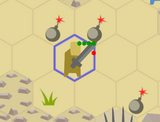

+++
title = "Zemeroth v0.5: ggez, WASM, itch.io, visuals, AI, campaign, tests"
slug = "2019-04-14--devlog-zemeroth-v0-5"
+++

<!-- markdownlint-disable MD013 -->
<!-- cspell:ignore Berserker Muton kiegel Yururu ldjam devs itchio PNGs -->

Hi, folks! I'm happy to announce **Zemeroth v0.5**.
Main features of this release are:
migration to ggez, web version, itch.io page, campaign mode,
AI improvements, visual updates, and tests.


[Zemeroth] is a turn-based hexagonal tactical game written in Rust.
You can [download precompiled v0.5 binaries][release v0.5]
for Windows, Linux, and macOS.
Also, now you can **[play an online version][itch_zemeroth]**
(_read more about it in the "WebAssembly version" section below_).

> 

The last release happened about a year ago.
Since then the development mostly happened in irregular bursts,
sometimes it even was completely stalled for weeks.
But a year is a big period of time anyway, so there're still lots of changes.

Lots of text ahead, feel free to skip sections
that you're not interested in particularry.
Here's a table of contents:

- [Migration to the `ggez` Game Engine](#migration-to-the-ggez-game-engine)
- [WebAssembly Version](#webassembly-version)
- [itch.io](#itchio)
- [Visual Improvements](#visual-improvements)
- [Simple Campaign Mode](#simple-campaign-mode)
- [Hit Chances](#hit-chances)
- [Armor](#armor)
- [AI updates](#ai-updates)
- [Bombs and Commutative Effects](#bombs-and-commutative-effects)
- [Other Game Rules Changes](#other-game-rules-changes)
- [Gameplay Video](#gameplay-video)
- [SVG Atlas](#svg-atlas)
- [Assets Hash](#assets-hash)
- [Tests](#tests)
- [Other Technical Changes](#other-technical-changes)
- [Indikator](#indikator)
- [Migrated this devlog to Zola](#migrated-this-devlog-to-zola)
- [Roadmap](#roadmap)

[release v0.5]: https://github.com/ozkriff/zemeroth/releases/tag/v0.5.0

## Migration to the `ggez` Game Engine

An experiment with maintaining my own engine
(even a simple and minimalistic 2D one)
turned out to be too exhausting in practice:
you have to fight a constant stream of reports about small corner case issues
and deal with platform-specific tweaks and hacks
(stuff [like this](https://github.com/ggez/ggez/issues/587), for example).
It can consume surprisingly large amounts of time.
But what's is more important for a hobby project,
it also sucks too much fun out of the development process.

And what made it worse in my case is that [Häte2d][docs_hate] intentionally wasn't
a general-purpose game engine (to reduce the scope of work),
so it was sad to know that all this work won't be reused by anyone.
But converting Häte into a real general-purpose engine wasn't an option too,
because it wouldn't have left any time for Zemeroth's development.

So I've surrendered and decided to give away some control over
low-level parts of Zemeroth:
[Häte2d was discontinued][pr247] and replaced by [ggez], the most mature and
actively developed Rust 2d game engine at that time.


`häte` had some builtin basic
[scene management](https://docs.rs/hate/0.1.0/hate/scene/)
and [GUI](https://docs.rs/hate/0.1.0/hate/gui/) systems,
but ggez is minimalistic by design and has none of this.
So, two helper crates were extracted from Häte2d and rebuilt on top of ggez:

- [ggwp-zscene](https://github.com/ozkriff/zemeroth/tree/721ad06a6/ggwp-zscene)
  is a simple scene/declarative animation manager that provides:
  - Sprites with shared data;
  - Scene and Actions to manipulate sprites;
  - Simple layers;
- [ggwp-zgui](https://github.com/ozkriff/zemeroth/tree/721ad06a6/ggwp-zgui)
  is a tiny and opinionated UI library:
  - Provides only simple labels, buttons and layouts;
  - Handles only basic click event;
  - No custom styles, only the basic one.

Since Icefoxen [asked not to use `ggez-` prefix][ggwp],
I used `ggwp-` ("good game, well played!") to denote that the crate
belongs to ggez's ecosystem, but is not official.

These libraries are still tied to Zemeroth,
not sure how helpful these libraries can be for a project that is not Zemeroth.
You probably won't be able to use them without changes in other games.
But maybe someone will manage ti extract some benefit from them.

These crates are still immature and aren't published on crates.io yet,
while the `rancor` component library was renamed to `zcomponents` and
[is published](https://crates.io/crates/zcomponents).

------

Initially I migrated to ggez v0.4 that was SDL2-based.
But as soon as the first release candidate of [winit]-based ggez v0.5
became available I attempted to migrate to it.
I've filed [a bunch of mostly text-related issues in the process][ggez_issues]
and tried to fix the most critical ones for Zemeroth:
["Remove the generic argument from Drawable::draw"](https://github.com/ggez/ggez/pull/559),
["Drawable::dimensions()"](https://github.com/ggez/ggez/pull/567) (big one!)
and ["Fix Text::dimensions height"](https://github.com/ggez/ggez/pull/593).
These PRs took some time, but then I relatively easy
[ported Zemeroth to ggez v0.5.0-rc.0](https://github.com/ozkriff/zemeroth/pull/426).

ggez v0.5 isn't released yet, so at the moment
Zemeroth uses ggez `0.5.0-rc.1`. It's stable enough for me.

------


Previously, I was using [cgmath] (because it's simple and straightforward).
ggez's "native" math library is nalgebra.
even though ggez v0.5 uses `mint` types for all its public API,
I still migrated to nalgebra, because
of [this](https://users.rust-lang.org/t/cgmath-looking-for-new-maintainers/20406).

------

One downside of the migration is that debug builds are much slower now,
because more code is pure Rust.
Something like 3-5 FPS on my notebook.
But it's ok, I don't need debug builds often,
I prefer debugging through logs anyway.
And even when I really need a debug build to track down something extremely strange,
I can use cargo's yet unstable feature
["profile-overrides" unstable feature][profile_overrides].

```toml
cargo-features = ["profile-overrides"]

[profile.dev.overrides."*"]
opt-level = 2
```

Another serious downside of the engine switch,
[though temporary](https://github.com/ggez/ggez/issues/70),
is that there's no native Android version of the game for now.
But who really needs a native port when you have...

[pr247]: https://github.com/ozkriff/zemeroth/pull/247
[ggez]: https://github.com/ggez/ggez
[docs_hate]: https://docs.rs/hate
[ggwp]: https://github.com/ggez/ggez/issues/373
[winit]: https://github.com/rust-windowing/winit
[cgmath]: https://github.com/rustgd/cgmath
[mint]: https://github.com/kvark/mint
[ggez_issues]: https://github.com/ggez/ggez/issues?q=is%3Aissue+author%3Aozkriff+created%3A%3E2019-01-01
[profile_overrides]: https://doc.rust-lang.org/nightly/cargo/reference/unstable.html#profile-overrides

## WebAssembly Version

After ggez v0.5-rc.0 was published, Icefoxen have posted
["The State Of GGEZ 2019"](https://wiki.alopex.li/TheStateOfGGEZ2019),
where among other things he wrote that
a web port is unlikely to happen soon because
a lot of issues in dependencies need to be fixed first.
It could be relatively easy to write a specialized web backend for ggez,
but ggez's philosophy is against having multiple backends.

And that's where [Fedor @not-fl3](https://twitter.com/notfl3) suddenly comes in
with his [good-web-game][good_web_game] WASM/WebGL game engine.

He had been experimenting with 2d web prototypes
([like this one](https://twitter.com/notfl3/status/1079499336243965952))
for some time and used a custom 2d web engine for this.
The API of this engine was heavily inspired by ggez
so he managed to write a partly ggez-compatible wrapper in a weekend.

Colors are slightly off and text rendering if a little bit different,
but otherwise it works nicely and smoothly,
providing the same experience:

[](2019-01-29--web-port-vs-native.jpg)

Zemeroth uses good-web-game for its web version as a quick-n-dirty
immediate solution until a proper WASM support arrives to GGEZ
(there're no plans of making good-web-game some kind of official GGEZ backend
or anything like this).
The currently implemented subset of ggez's API is quite limited
and while it may be used for something else that Zemeroth,
it will probably require a lot of work to do.

You can't use crate renaming in `Cargo.toml` to reuse a name on different platforms,

```toml
# Cargo.toml with this dependencies wouldn't build:

[target.'cfg(not(target_arch = "wasm32"))'.dependencies]
ggez = "0.5.0-rc.1"

[target.'cfg(target_arch = "wasm32")'.dependencies]
ggez = { git = "https://github.com/not-fl3/good-web-game", package = "good-web-game" }
```

So the crate substitution hack is done in `main.rs`
using `extern crate` items in `main.rs`:

```rust
#[cfg(not(target_arch = "wasm32"))]
extern crate ggez;

#[cfg(target_arch = "wasm32")]
extern crate good_web_game as ggez;
```

99.9% of code stays the same,
but I had to use a separate main, because good-web-game
has a different initialization API:

```rust
#[cfg(target_arch = "wasm32")]
fn main() -> GameResult {
    ggez::start(
        conf::Conf {
            cache: conf::Cache::Index,
            loading: conf::Loading::Embedded,
            ..Default::default()
        },
        |mut context| {
            let state = MainState::new(&mut context).unwrap();
            event::run(context, state)
        },
    )
}
```

Finally, a short helper script `utils/wasm/build.sh` was added:

```sh
#!/bin/sh
cp -r assets static
cp utils/wasm/index.html static
ls static > static/index.txt
cargo web build
```

- [cargo-web] only packs a `static` directory (it's hardcoded),
  so the script copies the game's assets there;
- the `index.html` template page is also copied there;
- all assets should be listed in `index.txt` for good-web-game to be able
  to load them, so this file is created;

You can find a minimal example of good-web-game
[here](https://github.com/not-fl3/good-web-game/tree/9b362da6d/examples/simple).

[good_web_game]: https://github.com/not-fl3/good-web-game
[cargo-web]: https://github.com/koute/cargo-web

## itch.io

The web version needs to be hosted somewhere.
[itch.io](https://itch.io/) is a nice place for this:

__[ozkriff.itch.io/zemeroth][itch_zemeroth]__

it has a nice and simple UI (for both developers and consumers),
it's extremely [easy to upload an web game there](https://itch.io/docs/creators/html5)
and it's a relatively known store for a indie games that can provide
some exposure by itself.

[](https://ozkriff.itch.io)

------

Note an "Enter fullscreen" button in the bottom right corner
of the game area:


------

As I've said in the ggez section above,
the web version of the game seems to work fine on most mobile devices:


------

Created [an itch.io list of Rust games][itch_rust_list].
When I find a Rust game on itch.io I add it there.

Also, I've sent a request to itch.io folks to add Rust as an instrument,
so now a more official list is available:
[itch.io/games/made-with-rust](https://itch.io/games/made-with-rust)
(you can edit a game's instruments here:
"edit game" -> "metadata" -> "engines & tools").
Looks like my original list will be deprecated with time but
it's still useful for now because only authors of the games can add
an instrument to the metadata.

------

With a playable version only a click away
I received a lot of fresh feedback:
a lot of people that previously were only following the development
now actually tried to play the game.

The most important things people want to see improved are:

- Improve the GUI: Replace text buttons with icons, show some tooltips, etc;
- Add a tutorial or at least a short guide;
- Randomness is too frustrating: missed attacks should result in some
  little positive effect, like pushing enemies back or reducing their stamina;
- Game lacks ranged attack units, like archers or knife throwers.

------

@Yururu even wrote
[a giant comment](https://itch.io/post/660275) on the itch page!
It's inspiring when
a stranger from the internet breaks through the crude primitive interface,
figures out game mechanics on a quite deep level,
and writes a detailed review of their experience and thoughts.

------

Btw, I've also created [an itch.io page for Zone of Control][itch_zoc].

[wasm_twit]: https://twitter.com/ozkriff/status/1090615410242785280
[itch_rust_list]: https://www.reddit.com/r/rust/comments/arm9dr/a_list_of_itchio_games_written_in_rust
[itch_zoc]: https://ozkriff.itch.io/zoc

## Visual Improvements

[Initial draft](https://twitter.com/ozkriff/status/975827153056075776)
of the new sprites looked like this:


Tiles are flatten now.
It's less a schematic top-down view as it was before.
"Camera" is moved to the side so the tiles and agents are shown
using the same projection.

There're many gradients in the mockup image above.
Later I decided to get rid of all thegradients and curvy lines
and stick with "pseudo lowpoly" style.

Floating Eye and Insecto-snake from the mockup haven't made it to the master yet.

------

All objects now have a shadow.
It makes the image a little bit more tangible.
Walk and especially throw animations feels better now.

Initially shadow was an ellipse with gradient.
Later it was replaced by two semi-transparent hexagons
for style consistency.

------

[Added blood splatters and weapon flashes](https://github.com/ozkriff/zemeroth/pull/401)
to make attacks more dramatic:


Direction of the blood splatter is opposite of attack's direction.
Number of drops depends on the attack's damage.
Blood slowly disappears into transparency in three turns,
otherwise the battlefield would become a complete and unreadable mess.

Adds weapon flashes of four types: slash, smash, pierce and claw;
Every agent now has `WeaponType`: "smash", "slash", "pierce", and "claw".
For now they are just a visual information.
They affect only what sprite is used during the attack animation.

Same as agent sprites, weapon flash sprites are not yet mirrored horizontally.
That is mostly noticeable with curvy smash sprite.

Also, spearman's "pierce" weapon sprite is horizontal and it looks weird
during vertical attacks.
Either multiple sprites are need or
it should be rotated.

------

[Added a Dust effect][pr390] (for jumps and throws):

[pr390]: https://github.com/ozkriff/zemeroth/pull/390


It is created by a simple function
that just emits a bunch of half-transparent sprites
and attaches position and color change actions to them.
Sprites' size, velocity and transparacy is a little bit randomized.

## Simple Campaign Mode

Basic campaign mod.
It's just a linear sequence of battles with predefined scenarios.
After each battle your survived fighters are carried over to the next battle.
If you loose a battle - campaign is over for you.
If you win a battle, you're shown a transition screen with a list
of your dead fighters, your current squad and possible recruits:


Campaign is defined by a [RON][ron] config file with this structure:

```text
initial_agents: ["swordsman", "alchemist"],
nodes: [
    (
        scenario: (
            map_radius: (4),
            rocky_tiles_count: 8,
            objects: [
                (owner: Some((1)), typename: "imp", line: Front, count: 3),
                (owner: Some((1)), typename: "imp_bomber", line: Middle, count: 2),
            ],
        ),
        award: (
            recruits: ["hammerman", "alchemist"],
        ),
    ),
    (
        scenario: (
            rocky_tiles_count: 10,
            objects: [
                (owner: None, typename: "boulder", line: Any, count: 3),
                (owner: None, typename: "spike_trap", line: Any, count: 3),
                (owner: Some((1)), typename: "imp", line: Front, count: 4),
                (owner: Some((1)), typename: "imp_toxic", line: Middle, count: 2),
                (owner: Some((1)), typename: "imp_bomber", line: Back, count: 1),
                (owner: Some((1)), typename: "imp_summoner", line: Back, count: 2),
            ],
        ),
        award: (
            recruits: ["swordsman", "spearman", "hammerman"],
        ),
    ),
]
```

Here's some real campaign scenario:
[campaign_01.ron](https://github.com/ozkriff/zemeroth_assets/blob/acd9fe9ef/campaign_01.ron)

There's a known bug that you can exit from a battle that is not going well
at any moment to start again.
This will be forbidden - permadeath is the only way :) .

## Hit Chances

I've added `attack_accuracy` and `dodge` stats to the `Agent` component and
[used these fields for some basic hit chances math](https://github.com/ozkriff/zemeroth/pull/370).

When you select an agent that can attack
(has an attack point and enemies in range)
a hit chance is shown over all aviable targets:


During the attack animation a hit chance is shown near
the attacker with a smaller font.


This was added in order for player to see how dangerous enemy attacks are.

------

Also, wounded agents now become less accurate.
Each lost strength point results in -10% hit chance penalty (up to -30%).

Missing strength points (wounds) are shown by almost transparent green dots:


This gameplay change has two game balance consequences:

- Now it's more important to wound enemies,
  finishing them off is a lower priority most of the time.
  Sometimes wounded enemies even can be helpful to the player,
  because they are not a real threat to player's fighters,
  but can block the path for other enemies;
- Alchemist's "heal" ability become important
  because your agents are less useful when wounded too.

Also, attacks with strength > 1 have additional hit chances - with reduced damage
(each attack strength point gives 10% hit chance improvement).
This emulates the situation when an attacker barely touches their target
but still manages to make some damage to it.

## Armor

Implemented a basic armor system.
Armor points is shown above the agent in one line with strength points
using the yellow dots.
Each armor point deflects one damage point on each attack.
Some weapons can break armor (the `attack_break` parameter).
Fire and poison ignore armor.

Here's a little demo:


- an imp can't break armor so he can't deal any damage to the heavy swordsman;
- toxic imp can't deal any direct damage but he poisons the swordsman
  ignoring the armor;
- insecto-snake destroys the armor with a powerful attack.

In the current version of the game only the imp summoner has the armor,
so be carefull with them.

## AI updates

- Now, enemies always act in order of remoteness from a player's fighters.
  This way melee imps don't trip over each other too much.

- AI learned to avoid walking into spikes, fire and poison clouds.

- AI now moves closer to its targets even if there's no direct path to them
  ([full demo video](https://youtu.be/09ODLL_Nu8w)):

  [](https://youtu.be/09ODLL_Nu8w)

- Non-melee imps (bombers and summoners) are now
  [trying to keep distance in range](https://github.com/ozkriff/zemeroth/pull/298).
  They need to avoid melee fights but still be able to throw bombs
  at a player's fighters or summon new imps nears the frontline.
  Summoner have a greater min/max range than bombers.

  

During the debugging of the abovementioned features
I also wrote a simple helper function `dump_map` that takes a closure
and dumps required map data as an ascii.
In the above GIF, pic 1 shows objects (`A` - an agent, `O` - a non-agent object)
and pic 2 shows available positions (`X`).

## Bombs and Commutative Effects



^ In previous version of Zemeroth,
each of these bombs would have explode at the beginning of the next turn
in order of their creation.
But this order is hard to remember and it's not clear from the picture at all.

The order is very important as the explosions push back objects - if the first
explosion is on the left, an agent will be damaged by the right bomb too.

Pushback is not the only possible effect suffering from this.
Other possible examples of non-commutative effects:
teleportation, armor-breaking acid, immunity to damage, etc.
Anything where changing the order of application can change the final state.

I see two possible ways to solve this:

1) "Into the Breach"-like approach with explicit numbers;
2) Forbid non-commutative delayed effects.

ItB's approach means just adding this order information
explicit in the game's interface.
It looks like this:

[](2018-06-22-into-the-breach.png)

Technically it's possible, but I don't think that it fits for Zemeroth
because it's an extremely noisy interface feature,
but it's not really a core mechanic.

So, [I've took the latter way][pr296]:
the "Bomb" ability was split into two abilities: instant "BombPush"
and delayed "BombDamage".

The plan is to have three groups of objects with effects:

- Objects with immediate effects - can have non-commutative effects;
- General objects with timed effects - only commutative effects allowed;
- Special rare timed objects - can do whatever they want,
  only allowed as unique boss abilities, work in their own special phase.

    [pr296]: https://github.com/ozkriff/zemeroth/pull/296

## Other Game Rules Changes

- Spike traps were added. They're almost like a fire tiles, but permanent.

  

- [Updated](https://github.com/ozkriff/zemeroth/pull/351) "Poison" passive ability:
  it can’t, by itself, kill an agent anymore.
  “Poisoned” status is removed when a target’s strength is reduced to 1.
  This should make battles a little bit less frustrating and more dramatic.

- Updated to the "Summon" ability:

  [Each agent is now treated individually](https://github.com/ozkriff/zemeroth/pull/413).
  The new code treats each summoned agent individually
  thus preventing summoning packs of same unit types.

  [Each use of the "Summon" ability now creates one more imp (up to 6)](https://github.com/ozkriff/zemeroth/pull/349).
  It should force the player to be more aggressive.

  [Changed the summoning algorithm to prefer imp types that are under-presented
  on the map, not just random ones](https://twitter.com/ozkriff/status/1040321852495863808).
  Seems to work fine now - even with increased summon rate imp types
  are balanced in count.: [img](2018-09-14--fixed-summoning.png).
  This prevents Imp Summoners from being created only a tile away from enemies
  and thus not having any chances to survive.

- [Randomly-placed agents are not created point-blank to their enemies anymore][pr360].

- Also, [randomly-placed objects are now created on the different `Line`s][pr369].
  This prevents Imp Summoners from being created only a tile away from enemies
  and thus not having any chances to survive.
  Or Imp Bombers being instantly tied with a melee fight.

  A line is defind in the scenario files:

  `(owner: Some((1)), typename: "imp", line: Front, count: 4),`

  There're four possible values:

  `pub enum Line { Any, Front, Middle, Back }`

[pr360]: https://github.com/ozkriff/zemeroth/pull/360
[pr369]: https://github.com/ozkriff/zemeroth/pull/369

## Gameplay Video

So, putting these gameplay changes together:

(**_TODO: Record a gameplay video. A campaign walkthrough_**)

This is a piece of a failed campiang's walkthrough.
Battles 4, 5, and 6.

## SVG Atlas

Back to more technical updates.

As git is bad at storing non-text files and
it's practically impossible to use [Git LFS] with a free GitHub plan
(because of [the bandwith limitations][github_lfs_bandwith]),
it looks like a good idea to keep text source files, assets source files,
and built assets in separate repositories
to make "optimization history editing" (removing old commits) easier.

[The main repo](https://github.com/ozkriff/zemeroth)
and [the assets repo](https://github.com/ozkriff/zemeroth_assets)
already existed,
but I wasn't storing assets source files in any VCS.

So, during v0.5 development I've crated another repo for assets sources:
[ozkriff/zemeroth_assets_src](https://github.com/ozkriff/zemeroth_assets_src).
The two key files of this repo are: [atlas.svg] and [export.py].

The atlas contains all sprites in one file.
Each sprite is stored as a named group.
As the game isn't that much art heavy, using one file for all visual assets
looks fitting, because it:

- simplifies sharing parts of sprites and mockups creation;
- avoids complications of linking/embedding multiple svg files together
  (you need to manually edit xml do to this properly as far as I know).

The export script is quite simple, it just calls inkscape using its CLI
interface and tells what named group needs to be exported to PNGs.
It boils down to:

```python
for id in ['imp', 'imp_toxic', 'grass', ...]:
    subprocess.run([
        'inkscape',
        input_file_name,
        f'--export-id={id}',
        f'--export-png={out_dir_name}/{id}.png',
    ], check=True)
```

There's also a hack to avoid specifying exact sprite PNG sizes
as raw numbers in the export script:
each named group contains an invisible square (a rectangle for terrain tiles).
It can be temporary made slightly visible for debugging purposes:

[](2018-07-16--svg-atlas-test.png)

[atlas.svg]: https://github.com/ozkriff/zemeroth_assets_src/blob/1f1813eff/atlas.svg
[export.py]: https://github.com/ozkriff/zemeroth_assets_src/blob/1f1813eff/export.py
[Git LFS]: https://git-lfs.github.com
[github_lfs_bandwith]: https://help.github.com/en/articles/about-storage-and-bandwidth-usage

## Assets Hash

Another technical assets-related update is that a md5 hash check was added.
This should help to detect when someone who is building from source
forgets to update the assets.

A small [checksum.py] python script is used to calculate the hash
of all non-hidden files in the repo.
[CI uses it to check][assets_travis_yml]
that the committed hashsum really corresponds to the committed assets.

The expected hash is [hardcoded directly into main.rs][hardcoded_hashsum].

If the game is run with a wrong version of assets,
not you get a clear error message about that:

```text
Bad assets checksum abcdeabcdeabcdeabcdeabcdeabcdeab (expected 18e7de361e74471aeaec3f209ef63c3e)
```

[assets_travis_yml]: https://github.com/ozkriff/zemeroth_assets/blob/acd9fe9ef/travis.yml
[checksum.py]: https://github.com/ozkriff/zemeroth_assets/blob/acd9fe9ef/checksum.py
[hardcoded_hashsum]: https://github.com/ozkriff/zemeroth/blob/721ad06a6src/main.rs#L92

## Tests

One of the benefits of making a turn-based game is that you can relatively easy
separate the logic from the visuals and cover the former with tests.

[A few test scenarios were added](https://github.com/ozkriff/zemeroth/pull/439).

Test scenarios are completely deterministic.
Randomness is mitigated with special agent types with unrealistic stats
(for example, accuracy = 999, strength = 1), that allows them
to always pass required tests (for example, always hits or always dies),
and an additional `no_random` flag in the game state, that causes a panic
if agent's stats during the "dice roll" may result in non-determined results
(basically, it checks that the coefficients are large or low enough
to shut off any dice value fluctuations).

"Exact objects" were added to the scenarios.
Test scenarios mustn't contain any randomly-placed objects,
otherwise the `no_random` debug flag will cause a panic.

Basic test looks like this:

```rust
#[test]
fn basic_move() {
    let prototypes = prototypes(&[
        ("mover", [component_agent_move_basic()].to_vec()),
        ("dull", [component_agent_dull()].to_vec()),
    ]);
    let scenario = scenario::default()
        .object(P0, "mover", PosHex { q: 0, r: 0 })
        .object(P1, "dull", PosHex { q: 0, r: 2 });
    let mut state = debug_state(prototypes, scenario);
    let path = Path::new(vec![
        PosHex { q: 0, r: 0 },
        PosHex { q: 0, r: 1 },
    ]);
    exec_and_check(
        &mut state,
        command::MoveTo {
            id: ObjId(0),
            path: path.clone(),
        },
        &[Event {
            active_event: event::MoveTo {
                id: ObjId(0),
                path,
                cost: Moves(1),
            }
            .into(),
            actor_ids: vec![ObjId(0)],
            instant_effects: Vec::new(),
            timed_effects: Vec::new(),
            scheduled_abilities: Vec::new(),
        }],
    );
}
```

(_I didn't use the builder patter for event construction,
even though most of the time two or three it's fields are empty vectors,
because I've faced some [method chains formatting issues][fmt_issue]_)

Test scenario consists of list of commands and a list of expected events.
Occasionally, it can check some parts of the state.

A prototypes list and a scenario is created from scratch
(though, with some helper functions) for each test.
It takes more lines of code that reusing a small set of multicases scenarios,
but the idea is that this way the amount of objects and components in each test
is minimized.
This way it's easier to diagnose the bug
and makes tests less likely to break on unrelated game logic change.

A "dull" enemy agent is required only for the scenario not to end instantly.
Because the win condition is when no enemy agents is alive.

------

[colin-kiegel/rust-pretty-assertions](https://github.com/colin-kiegel/rust-pretty-assertions)
is a is super-useful crate when you need to debug
failing assert comparisons of big hierarchical objects
(some of which may be many screens long in my case).


One peculiarity is that I had to replace all `HashMap<ObjId, Vec<Foo>>`
in events with `Vec<(ObjId, Vec<Foo>)>` to preserve the order.
Otherwise pretty-assertion have been exploding.

[fmt_issue]: https://github.com/rust-lang/rustfmt/issues/3157#issuecomment-472718887

## Other Technical Changes

- [Moved all crates to Rust 2018](https://github.com/ozkriff/zemeroth/pull/394);
- [Added a note about 'help-wanted' issues](https://github.com/ozkriff/zemeroth/pull/226);
- Used `derive_more::From` for enums and errors;
- [Migrated to `std::time::Duration`](https://github.com/ozkriff/zemeroth/pull/229)
  and added `time_s` shortcut/helper function;
- Fixed a fun bug ([taking control of imp summoners](https://github.com/ozkriff/zemeroth/issues/288));
- [Removed](https://github.com/ozkriff/zemeroth/pull/365) some data duplication
  from [the `.ron` config with objects descriptions][objects_ron]
  using serde\`s default annotations and helper init functions;
- [Added a `windows_subsystem` attribute](https://github.com/ozkriff/zemeroth/pull/220).
  Don't show cmd window;
- [Fix panic when boulder is pushed into fire/spikes](https://github.com/ozkriff/zemeroth/pull/233);
- [Merge all 'line_height' consts and functions](https://github.com/ozkriff/zemeroth/pull/431);
- [Removed data duplication from `objects.ron`](https://github.com/ozkriff/zemeroth/pull/365).

[objects_ron]: https://github.com/ozkriff/zemeroth_assets/blob/69e6fb34c/objects.ron

## Indikator

[Gave a presentation about Zemeroth][indikator_twit] at 8th Indie-StandUp
at [Indikator](http://indierocket.ru).
It went pretty good, local indie devs seemed to like the project,
especially considering that it's opensource and uses an interesting tech.
At least one of the devs has visited
[our local rustlang meetup](https://www.meetup.com/spbrust) afterwards. 🦀


Also, [Zemeroth was mentioned on Amit's page about hex math][amit].

[indikator_twit]: https://twitter.com/ozkriff/status/1058359693503070208
[amit]: https://www.redblobgames.com/grids/hexagons/implementation.html

## Migrated this devlog to Zola

During the preparation for this Zemeroth release I've [finally][md_to_rst_plans]
switched the static site generator behind this devlog
from python-based [Pelican](https://getpelican.com) to rustlang-based [Zola].

[Here's a twitter thread](https://twitter.com/ozkriff/status/1119212330246656002)
with some migration notes.

TLDR is that
I've mostly automatically converted all RestructuredText post sources into Markdown,
replaced [Disqus comments](http://disqus.com) with direct links to reddit/twitter/etc,
and migration went quite nice.

[Zola]: http://getzola.org
[md_to_rst_plans]: https://ozkriff.github.io/2017-12-01--devlog/index.html#restructuredtext-markdown

## Roadmap

What's next? Some things I _hope_ to implement for v0.6 release are:

- [Replace the text buttons with icons](https://github.com/ozkriff/zemeroth/issues/276);
- [Reduce text overlapping](https://github.com/ozkriff/zemeroth/issues/214);
- [Add sound effects and music](https://github.com/ozkriff/zemeroth/issues/221);
- [Add fighters upgrade trees](https://github.com/ozkriff/zemeroth/issues/399);

You can find a slightly more detailed roadmap
[in the project's README](https://github.com/ozkriff/zemeroth#roadmap).

------

That's all for today, thanks for reading!

If you're interested in this project you can follow
[@ozkriff on Twitter](https://twitter.com/ozkriff) for more news.

Also, if you're interested in Rust game development in general,
you may want to check [@rust_gamedev](http://twitter.com/rust_gamedev)
twitter account that I've started recently.

<!--
**Discussions of this post**:
[/r/rust](__TODO__),
[twitter](__TODO__).
 -->

[Zemeroth]: https://github.com/ozkriff/zemeroth
[itch_zemeroth]: https://ozkriff.itch.io/zemeroth
[ron]: https://github.com/ron-rs/ron
