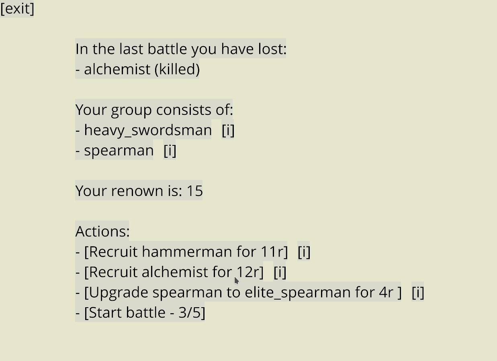

+++
title = "Zemeroth v0.6: Renown, Upgrades, Frames, Flipping and Effect Icons"
slug = "2019-08-26--devlog-zemeroth-v0-6"
+++

**TODO**: _rename the file to `2019-08-31--devlog-zemeroth-v0-6.md`_

<!-- markdownlint-disable MD013 -->
<!-- cspell:ignore reddit playtests indiedb tigsource -->
<!-- cspell:ignore indistinctly zscene KDEnlive ezgif Kubuntu -->

Hi, folks! I'm happy to announce **Zemeroth v0.6**.
Main features of this release are:
renown, agent upgrades, visual improvements,
status effect icons, logo.
(**TODO**).

**TODO**: _Title GIF demo (or a video)_

[Zemeroth] is my hobby turn-based hexagonal tactics game written in Rust.
You can [download precompiled v0.6 binaries][release v0.6]
for Windows, Linux, and macOS
or [play the online version on itch.io][itch_zemeroth]
(works on mobile browsers too).

<!-- ------ -->

<!-- **TODO**: _preface?_ -->

I've experimented a little bit with [smaller forum updates](TODO:_URLO_link)
and [video devlogs](https://youtu.be/EDoxb7vbqgg),
but I failed to make them regularly.
Actually, I managed to only publish one such update.
Drafts for second and third were written, but I haven't finished them.
So I decided to cancel these experiments and just
try harder to make a more often and smaller version releases.
<!-- at least make regular releases more often -->
and record videos for them.

Here's a video version of this post:

**TODO**: _video version of the devlog post (don't embed html, just use a helper image)_

<!-- I've removed planned versions from the roadmap.
(TODO: I don't really need to mention this)-->

<!-- I don't really need all of this, I just need to make smaller releases. -->

<!-- 
Here's my first video devlog ever (_[/r/rust_gamedev discussion](https://www.reddit.com/r/rust_gamedev/comments/bwquqy/zemeroth_dev_vlog_1/)_):

<https://youtu.be/EDoxb7vbqgg>

I hope to keep these videos short and release them every week or two.
(**TODO**: Remove this I guess)
-->

[Zemeroth]: https://github.com/ozkriff/zemeroth
[itch_zemeroth]: https://ozkriff.itch.io/zemeroth
[release v0.6]: https://github.com/ozkriff/zemeroth/releases/tag/v0.6.0

## Renown and Agent Upgrades

"Renown" is a term obviously borrowed from [Banner Saga].

It's the currency of the campaign mode
that the player receives with each won battle.

The amount of received renown is encoded in a campaign's nodes.

Renown is spent between the battles on upgrading your fighters or recruiting new ones.



Recruit options are still hard-coded in campaign's nodes.

A sample from [assets/campaign_0.ron]:

```ron
Plan(
    initial_agents: [
        "swordsman",
        "spearman",
    ],
    nodes: [
        (
            scenario: (
                rocky_tiles_count: 0,
                objects: [
                    (owner: Some((1)), typename: "imp", line: Some(Front), count: 3),
                ],
            ),
            award: (
                recruits: ["hammerman", "alchemist"], // possible recruits
                renown: 17, // renown for the battle
            ),
        ),
        (
            scenario: (
                rocky_tiles_count: 5,
                objects: [
                    (owner: None, typename: "boulder", line: None, count: 1),
                    (owner: Some((1)), typename: "imp", line: Some(Front), count: 3),
                    (owner: Some((1)), typename: "imp_bomber", line: Some(Middle), count: 2),
                ],
            ),
            award: (
                recruits: ["spearman", "alchemist"],
                renown: 18,
            ),
        ),
        // etc...
```

(Hmm, I could really use some "implicit_option" attribute (**TODO**))

Costs and upgrade options are described in a [assets/agent_campaign_info.ron]
config:

```ron
{
    "swordsman": (
        cost: 10,
        upgrades: ["heavy_swordsman", "elite_swordsman"],
    ),
    "elite_swordsman": (
        cost: 15,
    ),
    "heavy_swordsman": (
        cost: 14,
    ),
    "spearman": (
        cost: 11,
        upgrades: ["heavy_spearman", "elite_spearman"],
    ),
    "elite_spearman": (
        cost: 15,
    ),
    // etc...
```

The expected size of the squad is 4..6 fighters,
so each new fighter costs more.
(**TODO**: _how? why? explain more about it_)

If you don't like upgrade options, you can skip straight to the next battle
(that will be more hard because you'll foo)
and use your renown later.

<!-- and only features "heavy" and "elite" (unbalanced) variations of swordsman and spearman for now. -->

**TODO**: heavy_hammerman, healer, firer

**TODO**: one upgrade path per agent


^ **TODO**: _redraw the image with a non-white background (skin looks bad on white bg), also fix "**heavy** swordsman"_

TODO: Describe what different properties do they have.

Heavy fighter variants are slower .(only two move points)

"elite" variants are generally faster and have more abilities or
can use them more often.

"Heavy-*" variants move slower (they have 2 move points instead of 3),
don't have any additional attacks.

Old fighters:

- "hammerman" - becomes a little bit weaker and loses "heavy strike"
  passive ability
- "alchemist" - loses all bombs except for pushing bomb

New fighters:

- "heavy hammerman" - more health, stronger but rarer attacks

    Balance Club ability: reduce duration and remove FlyOff effect

- "healer" - heals better and can throw only poison bomb

- "firer" - can't heal, but can throw bombs & firebombs

TODO: firer: now explosions destroy armor.

THe idea is that the player should never have enough renown to buy everything.

[Banner Saga]: https://bannersaga.gamepedia.com/Renown
[assets/campaign_0.ron]: https://github.com/ozkriff/zemeroth_assets/blob/e3886c064/campaign_01.ron
[assets/agent_campaign_info.ron]: https://github.com/ozkriff/zemeroth_assets/blob/e3886c064/agent_campaign_info.ron

<!-- ^ **TODO**: upgrade the commit (use v0.6's final commit) -->

## Agent's Info Screen

**TODO**: _This should be explained in terms of upgrades, I guess_

Added a basic agent info screen to Zemeroth.
Now you can look up some stats before recruiting or upgrading a fighter.


^ **TODO** _remake this screenshot, because hammerman has changed since then_

Opened by pressing on a small `[i]` button near fighter's type in the campaign menu:


**TODO**: Use smaller image.

This way you can check your current fighter's stats too.

**TODO**: Small `[i]` buttons, what are they?

## Visual Improvements

There're many small visual improvements.

### Current tile highlighting


First, a tile under the cursor is highlighted now.
Highlighting is disabled though on touch devices
(by ignoring an event if its delta movement is zero).

Based on feedback from playtests.

### Sprites Flipping


Next, agents now [can be flipped horizontally][pr473]
to match their action's direction.
I've wanted to add this for a long time because sometimes
units were attacking each other backwards and it was weird.

**TODO**: Implementation note: zscene::Action::???

**TODO**: - Small change: Flip weapon flashes horizontally;

### Dodge Animations


[Added][pr471] simple dodge animations when an attack misses

## Move Interruption Message


A helper message is [now shown][pr472]
when an agent's move is interrupted.

### Frames

Now [agents have special sprite frames for some abilities][pr476].


It's a compromise between having real animations and only having static pieces.

Also, spearman will get special directional attack frames soon (**TODO**: ?),
because he can attack enemies two tiles away from him
and it looks weird with completely static sprite sometimes (**TODO**: why?).

[pr471]: https://github.com/ozkriff/zemeroth/pull/471
[pr472]: https://github.com/ozkriff/zemeroth/pull/472
[pr473]: https://github.com/ozkriff/zemeroth/pull/473
[pr476]: https://github.com/ozkriff/zemeroth/pull/476

### Explosion Ground Marks

Decorative explosion ground marks were added:

<!-- TODO: this GIF doesn't work!!! -->


_**TODO**: insert "explosion_ground_mark.png" img_

Same as blood, they're slowly disappearing into transparency in three turns.
To avoid making the battlefield too noisy and unreadable.

### Status Effect Icons

Status effect icons were added.

**TODO**: _Show images_

- poisoned (skull)
- stunned (spiral)

**TODO**: _Possessed?_


I'm hoping to rework how the brief stats are displayed with dots someday,
but for now...

## Possession

Imp summoners can now possess imps to give them more action points for a few turns.

It uses a yellow lightning status icon.


Possessed imps can run through the whole map, make a lot of attacks,
and they won't stop on your reaction attacks.

So the player must look closely for potentially possessed imps and
be ready to reposition fighters to form a lethal defense line.

The idea is that the player should never be in a situation when
two possessed imps run towards a lonely and badly positioned fighter.


_**TODO**: How does this section works with "status effect icons"?_

_**TODO**: maybe this should be renamed?_

## External Contributions

There were a few PRs from external contributors:

- by [@debris](github.com/debris):
  - ["Bump ggez to version 0.5.0-rc.2"][pr485];
  - ["Highlight buttons on mouse over"][pr490];
  - ["Load sprites from sprites.ron file"][pr486];
- by [@ltfschoen](github.com/ltfschoen):
  - ["docs: Fix logic of insert within zcomponents"][pr491];
  - ["Update readme with instructions to add missing dependencies"][pr488].

[pr485]: https://github.com/ozkriff/zemeroth/pull/485
[pr490]: https://github.com/ozkriff/zemeroth/pull/490
[pr486]: https://github.com/ozkriff/zemeroth/pull/486
[pr491]: https://github.com/ozkriff/zemeroth/pull/491
[pr488]: https://github.com/ozkriff/zemeroth/pull/488

Thanks, folks!

## Other changes

- AI of the Summoner and Bomber imps is tweaked to **TODO** smaller distances;
  "Decrease distance ranges for summoners and bombers";
  Chasing summoners through the whole map with slow heavy fighters isn't fun.
  [pr508]

- "Add a mostly empty explicit rustfmt.toml file" - [pr495]

  [Motivation][i492]

- **TODO**: check PRs

[pr495]: https://github.com/ozkriff/zemeroth/pull/495
[i492]: https://github.com/ozkriff/zemeroth/issues/492
[pr508]: https://github.com/ozkriff/zemeroth/pull/508

## Text Logo

The game now has a text logo.
It's a manually "low poly vectorized" text written with the "Old London" font:


Not sure if it really fits the game, but it'll do for now.

## Spreading the Word

<!-- There're a couple of non-code updates. -->

<!-- I've added [a "Roadmap" section][roadmap] to the readme
to show in which direction the project moves.

^^^ **TODO**: _this was a part of 0.5 release, wasn't it?_ -->

<!-- The roadmap was extended and reformatted. -->

I also added [a new "Inspiration" section][inspiration]
with a list of games that inspire me to work on Zemeroth.
(**TODO**: name some of them)

I got the [ozkriff.games](https://ozkriff.games) domain
and moved my devlog there (_**TODO**: link to GitHub Pages' guide_).

My first domain, btw. The process isn't that scary.

[fb.com/ozkriff.games] and [vk.com/ozkriff.games] pages were created.

**TODO**: indiedb, tigsource

And I've revived my Patreon page: [patreon.com/ozkriff]

**TODO**: _What I'm going to do with it and what are my expectations?_

[fb.com/ozkriff.games]: https://fb.com/ozkriff.games
[vk.com/ozkriff.games]: https://vk.com/ozkriff.games
[patreon.com/ozkriff]: https://patreon.com/ozkriff
[roadmap]: https://github.com/ozkriff/zemeroth/blob/master/README.md#roadmap
[inspiration]: https://github.com/ozkriff/zemeroth/blob/0e789a546/README.md#inspiration

## Video (TODO: rename)

It's my first experience of recording video devlogs.

Recording as one piece totally fails for me.

Stressful.

TODO: Describe how the video is recorded

What app I use to make subtitles?

I'm using Kubuntu as main OS.

[Kdenlive](https://kdenlive.org).

English subtitles mostly for cases when I'm saying something too indistinctly

[KDE Subtitle Composer](https://store.kde.org/p/1126783).

Russian subtitles are, obviously, for comrades^W local folks
who aren't comfortable enough with English.

**TODO**: By the way, for the text version I'm usually using
[ezgif.com](https://ezgif.com) for converting and tweaking gifs.

<!-- ## Bonus
**TODO**: {piece of the video from Indikator} - Visited indikator.
**TODO**: _also, photos were uploaded_ -->

------

(**TODO**: _Don't forget to check that the last image in the post looks cool: Reddit will use it as a preview._)

That's all for today, thanks for reading!

(_**TODO:** link to the roadmap_)

If you're interested in this project you can follow
[@ozkriff on Twitter][@ozkriff] for fresh news.

Also, if you're interested in Rust game development in general,
you may want to check [@rust_gamedev on Twitter][@rust_gamedev].

<!--
TODO: uncomment when the post is published
**Discussions of this post**:
[/r/rust](TODO),
[twitter](TODO).
-->

[@ozkriff]: https://twitter.com/ozkriff
[@rust_gamedev]: https://twitter.com/rust_gamedev
