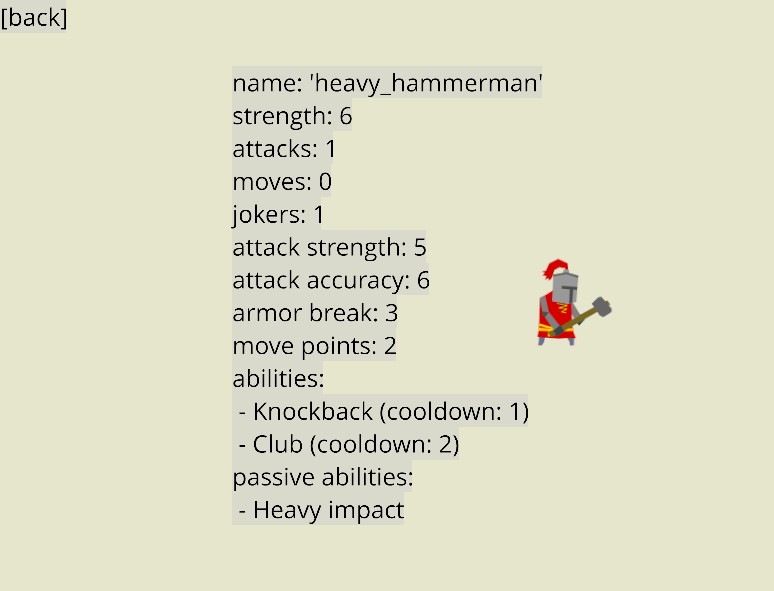
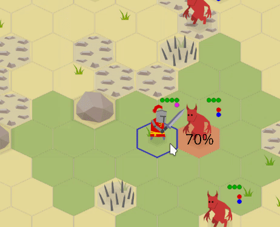

+++
title = "Zemeroth v0.6: Renown, Upgrades, Frames, Flipping and Effect Icons"
slug = "2019-09-04--devlog-zemeroth-v0-6"
+++

<!-- markdownlint-disable MD013 -->
<!-- cspell:ignore reddit playtests indiedb tigsource -->
<!-- cspell:ignore indistinctly zscene KDEnlive ezgif Kubuntu -->

Hi, folks! I'm happy to announce **Zemeroth v0.6**.
Main features of this release are:
renown and fighter upgrades, possessions, status effect icons,
and sprite frames and flips.

 <!-- **TODO**: ^^^ check the features list ^^^ -->


[Zemeroth] is my hobby turn-based hexagonal tactics game written in [Rust].
You can [download precompiled v0.6 binaries][release v0.6]
for Windows, Linux, and macOS
or **[play the online version on itch.io][itch_zemeroth]**
(should work on mobile browsers too).

After 0.5 release, I've experimented a little bit with
[smaller forum updates][zemeroth weekly]
and [short complimentary videos](https://youtu.be/EDoxb7vbqgg),
but I've expectedly failed to make them regularly.
Actually, I only managed to publish one such update:
drafts for second and third updates were never finished.
So, I decided to cancel my attempts at making weeklies and
squashed all the "weekly" text drafts together
into this normal announcement post.

Video drafts were also squashed into
**[a video version of this post][YouTube devlog]**,
check it out:

<!-- **TODO**: **{YouTube video}** -->

[][YouTube devlog] <!--TODO-->

So, what does this release add to the game?

[Zemeroth]: https://github.com/ozkriff/zemeroth
[Rust]: https://rust-lang.org
[itch_zemeroth]: https://ozkriff.itch.io/zemeroth
[release v0.6]: https://github.com/ozkriff/zemeroth/releases/tag/v0.6.0
[zemeroth weekly]: https://users.rust-lang.org/t/zemeroth-a-2d-turn-based-strategy-game/28311/5
[YouTube devlog]: https://TODO.todo

## Renown and Fighter Upgrades

The biggest updates of this release are
the renown system and fighter upgrades.

"Renown" is the currency of the campaign mode
that the player receives by winning battles
and spends on recruiting and upgrading their fighters between battles.
The term obviously borrowed from [Banner Saga].

Updated campaign menu looks like this:


Now it shows not only the player's last battle casualties
and theirs current fighters,
but also theirs current renown and a list of possible actions
with their costs (in renown).

The player is now free to choose more then one action
if they have enough renown.

One upgrade option is chosen randomly for up to two upgradable fighters
in the player's group.

If the player doesn't like provided upgrade options,
they can skip straight to the next battle
(that will be a little bit harder)
and use their renown later.

Recruit candidates (and the amount of received renown after a battle)
are still encoded in the `award` section of campaign's nodes
(this is likely to become a little bit more random too in future versions).
A sample from [assets/campaign_0.ron][campaign_ron]:

```ron
initial_agents: ["swordsman", "spearman"],
nodes: [
    // . . .
    (
        scenario: (
            objects: [
                (owner: None, typename: "boulder", line: None, count: 1),
                (owner: Some((1)), typename: "imp", line: Some(Front), count: 3),
                (owner: Some((1)), typename: "imp_bomber", line: Some(Middle), count: 2),
            ],
        ),
        award: (
            recruits: ["spearman", "alchemist"],
            renown: 18,
        ),
    ),
    // . . .
```

(_Note to myself: Employ an "[implicit_some]" RON extension._)

Fighter costs and upgrade options are described
in a [assets/agent_campaign_info.ron][agent_campaign_info_ron] config,
that looks like this:

```ron
{
    "swordsman": (
        cost: 10,
        upgrades: ["heavy_swordsman", "elite_swordsman"],
    ),
    "elite_swordsman": (cost: 15),
    "heavy_swordsman": (cost: 14),
    "spearman": (
        cost: 11,
        upgrades: ["heavy_spearman", "elite_spearman"],
    ),
    "elite_spearman": (cost: 15),
    // . . .
```

Recruitment cost consists is a basic type cost
plus a group size penalty (the player's fighters count).
Penalty is added because the intended size of the group
is four to six fighters.

The upgrade cost is just a difference between original
and upgraded type costs.

Now the campaign have some level of strategy:
the player should think if it's better to recruit a new fighter
or upgrade the existing ones.
The player should never have enough renown to buy everything they want.

<!-- and only features "heavy" and "elite" (unbalanced) variations of swordsman and spearman for now. -->

**TODO**: heavy_hammerman, healer, firer


TODO: Describe what different properties do they have.

Heavy fighter variants are slower .(only two move points)

"elite" variants are generally faster and have more abilities or
can use them more often.

"Heavy-*" variants move slower (they have 2 move points instead of 3),
don't have any additional attacks.

Old fighters:

- "hammerman" - becomes a little bit weaker and loses "heavy strike"
  passive ability
- "alchemist" - loses all bombs except for pushing bomb

New fighters:

- "heavy hammerman" - more health, stronger but rarer attacks

    Balance Club ability: reduce duration and remove FlyOff effect

- "healer" - heals better and can throw only poison bomb

- "firer" - can't heal, but can throw bombs & firebombs

TODO: firer: now explosions destroy armor.

[Banner Saga]: https://bannersaga.gamepedia.com/Renown
[campaign_ron]: https://github.com/ozkriff/zemeroth_assets/blob/e3886c064/campaign_01.ron
[agent_campaign_info_ron]: https://github.com/ozkriff/zemeroth_assets/blob/e3886c064/agent_campaign_info.ron
[implicit_some]: https://github.com/ron-rs/ron/blob/master/docs/extensions.md#implicit_some

<!-- ^ **TODO**: upgrade the commit (use v0.6's final commit) -->

## Agent's Info Screen

Have you noticed `[i]` buttons on the right from a fighter's type in the campaign menu?


Added a basic fighter info screen to Zemeroth.
Now the player can look up some stats before recruiting or upgrading a fighter.



^ **TODO** _remake this screenshot, because hammerman has changed since then_

Opened by pressing on a small `[i]` button near fighter's type in the campaign menu:

This way the player can check their current fighter's stats too.

## Possession

Imp summoners can now possess imps to give them more action points for a few turns.

It uses a yellow lightning status icon
(read more about the icons in the "Status Effect Icons" section below).


Possessed imps can run through the whole map, make a lot of attacks,
and they won't stop on your reaction attacks.

So the player must look closely for potentially possessed imps and
be ready to reposition fighters to form a lethal defense line.

The idea is that the player should never be in a situation when
two possessed imps run towards a lonely and badly positioned fighter.


_**TODO**: How does this section works with "status effect icons"?_

_**TODO**: maybe this should be renamed?_

## Visual Improvements

There're many small visual improvements in this release.

### Current Tile Highlighting


A tile under the cursor is highlighted now.

Highlighting is disabled on touch devices.

(by ignoring an event if its delta movement is zero).

**TODO**: _Add a little bit more details (and link to the code?)_

Based on feedback from playtests.

### Sprites Flipping


Next, agent sprites now [can be flipped horizontally][pr473]
to match their action's direction.
I've wanted to add this for a long time because sometimes
units were attacking each other backwards and it was weird.

**TODO**: _Implementation note: zscene::Action::???_

**TODO**: - Small change: Flip weapon flashes horizontally;

**TODO**: _say a few words about the history of this change and the hacks involved._

### Dodge Animations


[Added][pr471] simple dodge animations when an attack misses.

**TODO**: _say a few more words._

(In real life) it's hard to actually miss while attacking
a static target with a melee weapon.
99% of the time misses are because of target avoidance attempts.

This is now displayed in the game's animation.

### Move Interruption Message



A helper message is [now shown][pr472]
when an agent's move is interrupted.

**TODO**: _explain what movement interruption is and why this message is needed_.

### Frames

Now [agents have special sprite frames for some abilities][pr476].


It's a compromise between having real animations and only having static pieces.

Also, spearman will get special directional attack frames soon (**TODO**: ?),
because he can attack enemies two tiles away from him
and it looks weird with completely static sprite sometimes (**TODO**: why?).

[pr471]: https://github.com/ozkriff/zemeroth/pull/471
[pr472]: https://github.com/ozkriff/zemeroth/pull/472
[pr473]: https://github.com/ozkriff/zemeroth/pull/473
[pr476]: https://github.com/ozkriff/zemeroth/pull/476

### Explosion Ground Marks

Decorative explosion ground marks were added:


Same as blood, they're slowly disappearing into transparency in three turns.
To avoid making the battlefield too noisy and unreadable.

### Status Effect Icons

Status effect icons were added.

<!--  -->


**TODO**: _What is it? What is a timed effect?_

**TODO**: _Show images_

- poisoned (skull)
- stunned (spiral)

**TODO**: _Possessed?_


I'm hoping to rework how the brief stats are displayed with dots someday,
but for now...

## External Contributions

There were a few PRs from external contributors:

- by [@debris](github.com/debris):
  - ["Bump ggez to version 0.5.0-rc.2"][pr485];
  - ["Highlight buttons on mouse over"][pr490];
  - ["Load sprites from sprites.ron file"][pr486];
- by [@ltfschoen](github.com/ltfschoen):
  - ["docs: Fix logic of insert within zcomponents"][pr491];
  - ["Update readme with instructions to add missing dependencies"][pr488].

[pr485]: https://github.com/ozkriff/zemeroth/pull/485
[pr490]: https://github.com/ozkriff/zemeroth/pull/490
[pr486]: https://github.com/ozkriff/zemeroth/pull/486
[pr491]: https://github.com/ozkriff/zemeroth/pull/491
[pr488]: https://github.com/ozkriff/zemeroth/pull/488

Thanks, folks!

## Other Changes

- AI of the Summoner and Bomber imps is tweaked to **TODO** smaller distances;
  "Decrease distance ranges for summoners and bombers";
  Chasing summoners through the whole map with slow heavy fighters isn't fun.
  [pr508]

- Bomb explosions now destroy armor. (TODO: link?)

- "Add a mostly empty explicit rustfmt.toml file" - [pr495]

  [Motivation][i492]

- **TODO**: check PRs

[i492]: https://github.com/ozkriff/zemeroth/issues/492
[pr495]: https://github.com/ozkriff/zemeroth/pull/495
[pr508]: https://github.com/ozkriff/zemeroth/pull/508

## Gameplay Video

**TODO**: _Record a gameplay video_

Putting all these changes together:

[](TODO)

<!-- It starts reminding something like a real game, isn't it? :)
Though a lot of work is still need to be done. -->

## Text Logo

The game now has a text logo.
It's a manually "low poly vectorized" text
(**TODO**: more details)
written with the "Old London" font:


Not sure if it really fits the game, but it'll do for now.

## Spreading the Word

<!-- There're a couple of non-code updates. -->

<!-- I've added [a "Roadmap" section][roadmap] to the readme
to show in which direction the project moves.

^^^ **TODO**: _this was a part of 0.5 release, wasn't it?_ -->

<!-- The roadmap was extended and reformatted. -->

I also added [a new "Inspiration" section][inspiration]
with a list of games that inspire me to work on Zemeroth.
(**TODO**: name some of them)

I got the [ozkriff.games](https://ozkriff.games) domain
and moved my devlog there (_**TODO**: link to GitHub Pages' guide_).

My first domain, btw. The process isn't that scary.

[fb.com/ozkriff.games] and [vk.com/ozkriff.games] pages were created.

**TODO**: indiedb, tigsource

And I've revived my Patreon page: [patreon.com/ozkriff]

**TODO**: _What I'm going to do with it and what are my expectations?_

[fb.com/ozkriff.games]: https://fb.com/ozkriff.games
[vk.com/ozkriff.games]: https://vk.com/ozkriff.games
[patreon.com/ozkriff]: https://patreon.com/ozkriff
[inspiration]: https://github.com/ozkriff/zemeroth/blob/0e789a546/README.md#inspiration

## Video (TODO: rename)

**TODO:** _move this section to the next devlog_

It's my first experience of recording video devlogs.

Recording as one piece totally fails for me.

Stressful.

TODO: Describe how the video is recorded

What app I use to make subtitles?

I'm using Kubuntu as main OS.

[Kdenlive](https://kdenlive.org).

**TODO**: _Kdenlive screenshot_

English subtitles mostly for cases when I'm saying something too indistinctly

<!-- **TODO**: _is "indistinctly" a real word?_ -->

[KDE Subtitle Composer](https://store.kde.org/p/1126783).

Russian subtitles are, obviously, for comrades^W local folks
who aren't comfortable enough with English.

**TODO**: By the way, for the text version I'm usually using
[ezgif.com](https://ezgif.com) for converting and tweaking gifs.

<!-- ## Bonus
**TODO**: {piece of the video from Indikator} - Visited indikator.
**TODO**: _also, photos were uploaded_ -->

------

<!-- (**TODO**:
_Don't forget to check that the last image in the post looks cool:_
_Reddit will use it as a preview._) -->

That's all for today, thanks for reading!

[Here's Zemeroth's roadmap][roadmap],
if you want to know on what I'm going to work next.

If you're interested in this project you can follow
[@ozkriff on Twitter][@ozkriff] for fresh news
or subscribe to my [YouTube channel][ozkriff YouTube].

Also, if you're interested in Rust game development in general,
you may want to check [@rust_gamedev on Twitter][@rust_gamedev].

<!--
TODO: uncomment when the post is published
**Discussions of this post**:
[/r/rust](TODO),
[twitter](TODO).
-->

[roadmap]: https://github.com/ozkriff/zemeroth/blob/master/README.md#roadmap
[@ozkriff]: https://twitter.com/ozkriff
[@rust_gamedev]: https://twitter.com/rust_gamedev
[ozkriff YouTube]: https://youtube.com/user/ozkriff619/videos
