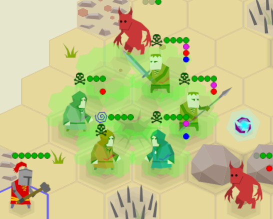

+++
title = "Zemeroth v0.6: Renown, Upgrades, Sprite Frames & Flips, Effect Icons, and Videos"
slug = "2019-09-16--devlog-zemeroth-v0-6"
+++

<!-- TODO: ^ change date! -->
<!-- TODO: when the post is finished check it with Grammarly! -->

<!-- markdownlint-disable MD013 -->
<!-- cspell:ignore reddit playtests indiedb tigsource nerfed Grammarly youtube -->
<!-- cspell:ignore indistinctly zscene KDEnlive ezgif Kubuntu Knockback -->

Hi, folks! I'm happy to announce **Zemeroth v0.6**.
Main features of this release are:
renown and fighter upgrades, possessions, status effect icons,
and sprite frames and flips.


[Zemeroth] is my hobby turn-based hexagonal tactics game written in [Rust].
You can [download precompiled v0.6 binaries][release v0.6]
for Windows, Linux, and macOS
or **[play the online version on itch.io][itch_zemeroth]**
(should work on mobile browsers too).

------

After 0.5 release, I've experimented a little bit with
[smaller forum updates][zemeroth weekly]
and [short complimentary videos](https://youtu.be/EDoxb7vbqgg),
but I've expectedly failed to make them regularly.
Actually, I only managed to publish one such update:
drafts for second and third updates were never finished.
So, I decided to cancel my attempts at making weeklies and
squashed all the "weekly" text drafts together
into this normal announcement post.

Video drafts were also squashed into
**[a video version of this post][YouTube devlog]**,
check it out:

<!-- **TODO**: **{YouTube video}** -->

[][YouTube devlog] <!--TODO-->

So, what does this release add to the game?

[Zemeroth]: https://github.com/ozkriff/zemeroth
[Rust]: https://rust-lang.org
[itch_zemeroth]: https://ozkriff.itch.io/zemeroth
[release v0.6]: https://github.com/ozkriff/zemeroth/releases/tag/v0.6.0
[zemeroth weekly]: https://users.rust-lang.org/t/zemeroth-a-2d-turn-based-strategy-game/28311/5
[YouTube devlog]: https://TODO.todo

## Renown and Fighter Upgrades

The biggest updates of this release are
the renown system and fighter upgrades.

"Renown" is the currency of the campaign mode
that the player receives by winning battles
and spends on recruiting and upgrading their fighters between battles.
The term obviously borrowed from [Banner Saga].

Updated campaign menu looks like this:


Now it shows not only the player's last battle casualties
and theirs current fighters,
but also theirs current renown and a list of possible actions
with their costs (in renown).

The player is now free to choose more then one action
if they have enough renown.

One upgrade option is chosen randomly for up to two upgradable fighters
in the player's group.

If the player doesn't like provided upgrade options,
they can skip straight to the next battle
(that will be a little bit harder)
and use their renown later.

Recruit candidates (and the amount of received renown after a battle)
are still encoded in the `award` section of campaign's nodes
(this is likely to become a little bit more random too in future versions).
A sample from [assets/campaign_0.ron][campaign_ron]:

```ron
initial_agents: ["swordsman", "spearman"],
nodes: [
    // . . .
    (
        scenario: (
            objects: [
                (owner: None, typename: "boulder", line: None, count: 1),
                (owner: Some((1)), typename: "imp", line: Some(Front), count: 3),
                (owner: Some((1)), typename: "imp_bomber", line: Some(Middle), count: 2),
            ],
        ),
        award: (
            recruits: ["spearman", "alchemist"],
            renown: 18,
        ),
    ),
    // . . .
```

(_Note to myself: Employ an "[implicit_some]" RON extension._)

Fighter costs and upgrade options are described
in a [assets/agent_campaign_info.ron][agent_campaign_info_ron] config,
that looks like this:

```ron
{
    "swordsman": (
        cost: 10,
        upgrades: ["heavy_swordsman", "elite_swordsman"],
    ),
    "elite_swordsman": (cost: 15),
    "heavy_swordsman": (cost: 14),
    "spearman": (
        cost: 11,
        upgrades: ["heavy_spearman", "elite_spearman"],
    ),
    "elite_spearman": (cost: 15),
    // . . .
```

Recruitment cost consists is a basic type cost
plus a group size penalty (the player's fighters count).
Penalty is added because the intended size of the group
is four to six fighters.

The upgrade cost is just a difference between original
and upgraded type costs.

Now the campaign have some level of strategy:
the player should think if it's better to recruit a new fighter
or upgrade the existing ones.
The player should never have enough renown to buy everything they want.

------

As for the new fighter types,
most of the current upgrades can be split into two "kinds":

- "Elite" fighters are generally faster, have more abilities and
  can use them more often.
  They feel overpowered at this iteration and most likely will be
  nerfed in next releases.

- "Heavy" fighters are the opposite:
  they move slower (two move points instead of three),
  have less attack points,
  but deal more damage and have more health points.

  Later I will convert some of their extended health points into armor points,
  but this doesn't work atm, because there're no enemies, except for Imp Summoners,
  that can do anything with an armored fighter.

Basic fighter types were nerfed:
less strength points, accuracy, abilities, etc,
but are still useful.

The idea is that the player should have fighters from all three types in their group:
slow heavies are supposed to be used as devastating "iron fist",
quick and agile elites are used for vanguard and flanks,
and basic fighters are used to fight weak enemies or finish off wounded ones.

Here are current "upgrade trees"
(they have only one level for now, but I'm planning to
add more nodes in future versions):


- **spearman** - still has 3 health points, "Jump" ability,
  and two-tile attack range,
  but lost one reaction attack, one accuracy and one dodge point.
  Only useful for defence.
  - **elite spearman** - has 4 health, one more accuracy and dodge points,
    and, most importantly, has an additional attack.
    The latter allows using him as a first fighter in a series of attacks,
    because he can move closer to enemies
    and instantly attack one of them from a safe distance,
    giving the initiative to the player.
  - **heavy spearman** - moves slowly, can't jump at all,
    but has 5 health and deals 2 damage
    (that's a lot, considering his two-tile attack range).
    Still only useful for defence, but is very effective.
- **swordsman** - has 3 health points (lost one), lost one accuracy
    and doesn't have "Dash" and "Rage" abilities anymore (only "Jump").
  - **elite swordsman** - has the stats of an old swordsman:
    4 health, more accurate and all three abilities:
    "Jump", "Dash", and "Rage".
  - **heavy swordsman** - slow and has no abilities at all,
    but has 6 health, increased accuracy and greater attack damage (3).
- **hammerman** - has 4 health points, and low accuracy.
    Lost "Heavy Strike" passive ability,
    but still have "Club" and "Knockback" abilities.
  - **heavy hammerman** - slow, lost one attack point,
    but deals up to 5 damage, breaks up to 3 armor,
    has 6 health, a "Heavy Strike" passive ability
    and both "Club" and "Knockback" abilities.
    Can slay even a fully fresh imp summoner in a few strikes.
- **alchemist** - lost all bombs except for the Push Bomb.
  Also, "Heal"'s cooldown in increased to 3 turns.
  - **healer** - heals more points with a 2 turns cooldown
    and can throw only Poison Bomb.
    Also, can do double moves in one turn for cases
    when the wounded fighter in on the other side of the map.
  - **firer** - can't heal anyone,
    but can do a mass destruction by throwing exploding and fire bombs.

(_See [objects.ron] for exact details._)

As you can see, sometimes the upgraded versions
lose some of their abilities.
These upgrades are more like a specialization, not just an improvement:
the fighter focuses on a smaller set of skills.

I also try to make fighter's stats match their visuals
so the situation described in this [itch.io review] won't repeat:

> ... the most mobile unit in the game is the only one wearing heavy armor.
> Perhaps it'd be more fitting for the Hammerman to be in plate.

[Banner Saga]: https://bannersaga.gamepedia.com/Renown
[campaign_ron]: https://github.com/ozkriff/zemeroth_assets/blob/e3886c064/campaign_01.ron
[agent_campaign_info_ron]: https://github.com/ozkriff/zemeroth_assets/blob/e3886c064/agent_campaign_info.ron
[implicit_some]: https://github.com/ron-rs/ron/blob/master/docs/extensions.md#implicit_some
[objects.ron]: https://github.com/ozkriff/zemeroth_assets/blob/master/objects.ron
[itch.io review]: https://itch.io/post/660275

<!-- ^ **TODO**: upgrade the commit (use v0.6's final commit) -->

## Agent's Info Screen

A basic fighter info screen was added:


It's opened by clicking on a small `[i]` button
on the right from a fighter's type in the campaign menu:


This screen allows the player to look up stats and abilities
before recruiting or upgrading a fighter.

## Possession

Another gameplay change is possessions:
imp summoners can now possess imps to give them more action points
for a few turns.

The "Possessed" status is visualized with a yellow lightning status icon
(read more about the status icons in the "Status Effect Icons" section below).


On the beginning of their turn,
possessed imp gets three additional Joker points
(reminder: Jokers can be used as attack or move points
and aren't removed when the agent receives damage).

Possessed imps can run through the whole map, make a lot of attacks,
and they won't stop on your reaction attacks until they're dead.
So the player must look closely for potentially possessed imps and
be ready to reposition fighters to form a lethal defense line:


The idea is that the player should never be in a situation like when
two possessed imps run towards a lonely and badly positioned fighter.

_Note_: "Possession" looks like to be a bad name
for one demon forcing a lesser demon to be more performing,
so this ability and effect will likely be renamed in future version.

## Visual Improvements

There're many small visual improvements in this release.

### Current Tile Highlighting

First, a tile under the cursor is highlighted now
when using a mouse (it was requested by many playtesters).
It makes no sense do this with touch inputs because
the user will just constantly see the latest tile he touched,
so the feature only works when input event's delta movement isn't zero.


^ _Switching between mouse input and touch emulation in the web version_

### Sprites Flipping

Next, agent sprites
[are now flipped horizontally][pr473]
to match their action's direction.
Weapon flashes are also now flipped when needed.


^ _A screenshot with both imps and humans faced left and right_

I've wanted to add this for a long time because previously
humans were facing strictly to the right (imps - to the left)
and sometimes they were attacking each other backwards.

To implement this `enum Facing { Left, Right }`,
a `Sprite::set_facing` method,
and a corresponding `action::SetFacing` scene action
[were added][pr473] to the `zscene` library.

The implementation of `Sprite:set_facing` is a little hacky atm.
I was hoping to implement this method
using only ggez's [ggez::DrawParams][draw_param]' `scale` and `offset` fields,
but because of the [this bug][ggez_i439]
it doesn't really works with custom screen coordinates that I'm using.
So the method was implemented on `zscene::Sprite`'s abstraction level using external offset.

[pr473]: https://github.com/ozkriff/zemeroth/pull/473
[draw_param]: https://docs.rs/ggez/0.5.1/ggez/graphics/struct.DrawParam.html
[ggez_i439]: https://github.com/ggez/ggez/issues/439

### Dodge Animations

In real life it's hard to actually miss while attacking
a static target with a melee weapon.
Most of the misses are caused by the targets dodging moves.
Simple target dodge animations when attack misses
[where added to the game][pr471] to display this.


^ _Dodge animations demo_

[pr471]: https://github.com/ozkriff/zemeroth/pull/471

### Move Interruption Message

If any tile of a movement path is inside the attack range
of an enemy agent with attack points, a reaction attack is triggered.
If this attack succeeds the movement is interrupted.

Move point (or Joker) is spent even if the agent hasn't actually moved anywhere:
the starting tile is also considered a part of the movement path.
This prevents agents from exiting a melee too easily
("Jump" and "Dash" abilities exist to counter this).

I like this mechanic, but sometimes it wasn't clear to playtesters what just happened:
they clicked on a tile, but were attacked and can't move anymore.

A helper message is [now shown][pr472] when an agent's move is interrupted.


^ _A demo of a heavy swordsman's failed attempt to move away from an imp_

[pr472]: https://github.com/ozkriff/zemeroth/pull/472

### Frames

From the beginning of the project I decided that I don't want
to implement real smooth animations for agents:
I don't like how 2D skeletal animations look in general
and per frame animations are too hard to make.
Quoting from [the initial vision]:

> \* Simple vector 2d graphics with just 3-5 sprites per unit;

So the plan was to have a few situational sprites
("attacking", "taking damage", etc) per unit
and use simple procedural animation to make the image more alive.
It's a compromise between having real animations and only having totally static pieces.

Some procedural animations
(like ["bumpy" walk][walking-animation]
or [blood splatters and dust][blood&dust])
were implemented in previous versions of the game,
but all agents still used only one sprite.

With this release, agents finally
[get special sprite frames for (some) abilities][pr476]!

**TODO**: _re-record the GIF with new agents_:


^ _A demo of special ability frames ("Rage", "Heal", and "Summon")_

For now, special frames are used only for the visualization of abilities.
I've tried adding "attack frames", but they conflicted too much with weapon flashes
and I decided that the game looks better without these frames.

Though, it's likely that spearman will get special directional attack frames
[in the next versions][i477],
because he can attack enemies two tiles away from him
and it looks weird with a completely static sprite sometimes
because the spear is too far away from its target.

------

Sprite sets are configured now with a [sprites.ron] config that looks like this:

```ron
{
    // ...
    "alchemist": (
        paths: {
            "": "/alchemist.png",
            "throw": "/alchemist_throw.png",
            "heal": "/alchemist_heal.png",
        },
        offset_x: 0.05,
        offset_y: 0.1,
        shadow_size_coefficient: 1.0,
    ),
    "imp_summoner": (
        paths: {
            "": "/imp_summoner.png",
            "summon": "/imp_summoner_summon.png",
        },
        offset_x: 0.0,
        offset_y: 0.15,
        shadow_size_coefficient: 1.3,
    ),
    // ...
}
```

The `""` (empty string) frame is considered the default frame.

As the event visualizers don't know anything about specific agent types,
the code usually checks if the sprite has some event-specific frame and only then
adds an action node that will switch the sprite to that frame during its execution:

```rust
let frame = "jump";
if sprite_object.has_frame(frame) {
    actions.push(action::SetFrame::new(&sprite_object, frame).boxed());
}
```

Frames are stored inside the `zscene::Sprite` struct like this:

```rust
drawable: Option<Box<dyn Drawable>>,
drawables: HashMap<String, Option<Box<dyn Drawable>>>,
current_frame_name: String,
```

I didn't want to index a HashMap with a string for every sprite
on every frame, so the current frame lives in a special field `drawable`
and everything is stored as options to simplify frame swapping.

[the initial vision]: https://ozkriff.github.io/2017-08-17--devlog/index.html#zemeroth
[walking-animation]: https://ozkriff.games/2018-03-03--devlog/index.html#simple-walking-animation
[blood&dust]: https://ozkriff.games/2019-05-13--devlog-zemeroth-v0-5/index.html#visual-improvements
[pr476]: https://github.com/ozkriff/zemeroth/pull/476
[i477]: https://github.com/ozkriff/zemeroth/issues/477
[sprites.ron]: https://github.com/ozkriff/zemeroth_assets/blob/56b620664/sprites.ron

### Explosion Ground Marks

To make the battlefield look more interesting
decorative explosion ground marks were added:


Same as blood, they're slowly disappearing into transparency in three turns
to avoid making the battlefield too noisy and unreadable.

It looks boring when there're many similar big explosion mark sprites
on the battlefield, so in future versions there should be
something like 3-5 randomly chosen versions of this sprite ([#531][i531]).

[i531]: https://github.com/ozkriff/zemeroth/issues/531

### Status Effect Icons

Icons for lasting effects were [added][pr511]
so the player can quickly see a more detailed game state info:



There're three lasting effects atm:


If there're more than one lasting effect applied to one agent,
icons are stacked vertically:


The icons are twice the size of brief info dots,
because they're more detailed.

[pr511]: https://github.com/ozkriff/zemeroth/pull/511

## External Contributions

There were a few PRs from external contributors:

- by [@debris](github.com/debris):
  - ["Bump ggez to version 0.5.0-rc.2"][pr485];
  - ["Highlight buttons on mouse over"][pr490];
  - ["Load sprites from sprites.ron file"][pr486];
- by [@ltfschoen](github.com/ltfschoen):
  - ["docs: Fix logic of insert within zcomponents"][pr491];
  - ["Update readme with instructions to add missing dependencies"][pr488].

[pr485]: https://github.com/ozkriff/zemeroth/pull/485
[pr490]: https://github.com/ozkriff/zemeroth/pull/490
[pr486]: https://github.com/ozkriff/zemeroth/pull/486
[pr491]: https://github.com/ozkriff/zemeroth/pull/491
[pr488]: https://github.com/ozkriff/zemeroth/pull/488

Thanks, folks!

## Other Changes

- AIs of the Summoner and Bomber imps [were tweaked][pr508]
  to keep shorter distances,
  because chasing summoners through the whole map
  with slow heavy fighters is just boring.
- The "Explosion Bomb" ability was balanced:
  explosions [now destroy armor][pr505].
  This was done to balance this ability with a "Fire Bomb".
- The "Club" ability [was balanced][pr514]:
  its duration was educed and the "Fly Off" effect was remove.
  This was done to better differentiate it with the "Knockback" ability.
- A mostly empty rustfmt.toml file [was added][pr495] to the repo
  ([to explicitly document the desired formatting][i492]).
- I added [a new "Inspiration" section][inspiration]
  to the README with a list of games that inspire(d) Zemeroth.

[pr505]: https://github.com/ozkriff/zemeroth/pull/505
[pr508]: https://github.com/ozkriff/zemeroth/pull/508
[pr495]: https://github.com/ozkriff/zemeroth/pull/495
[pr514]: https://github.com/ozkriff/zemeroth/pull/514
[i492]: https://github.com/ozkriff/zemeroth/issues/492
[inspiration]: https://github.com/ozkriff/zemeroth/blob/0e789a546/README.md#inspiration

<!--
## Gameplay Video

**TODO**: _Record a gameplay video._

Putting all these changes together:

[](TODO)

**TODO**: _Add some short description._
-->

## Text Logo

The game now has a (temporary?) text logo:


The image was manually re-drawn
(in a low-poly style similar to game's angular sprites)
from a text written in the ["Old London"] font.

Not sure if it really fits the game - surprisingly many people say
that it looks like something related to Death Metal
and not just a generic medieval font - but it'll do for now.

["Old London"]: https://www.dafont.com/old-london.font

## Spreading the Word

I've got the [ozkriff.games] domain
and [moved my devlog to it][gh pages domain].
This is my first domain and the buying process turned out to be
not nearly as scary as I was expecting.

I revived my Patreon page: [patreon.com/ozkriff].

I also created new social pages
(in addition to [twitter][@ozkriff]):

- [fb.com/ozkriff.games]
- [vk.com/ozkriff.games] (ru)

... and a bunch forum threads and database pages
(in addition to [itch.io][itch_zemeroth]):

- [tigsource]
- [indiedb]
- [users.rust-lang.org]
- [gamejolt]
- [gamedev.ru] (ru)

The initial plan was to post weekly updates to Patreon, forums, and catalogue pages
but as that experiment was cancelled (see the preface)
I most likely will just post links to new version announces there.
Let's hope that this will motivate me to make smaller releases more often. :)

[ozkriff.games]: https://ozkriff.games
[fb.com/ozkriff.games]: https://fb.com/ozkriff.games
[vk.com/ozkriff.games]: https://vk.com/ozkriff.games
[patreon.com/ozkriff]: https://patreon.com/ozkriff
[gh pages domain]: https://help.github.com/en/articles/using-a-custom-domain-with-github-pages
[users.rust-lang.org]: https://users.rust-lang.org/t/zemeroth-a-2d-turn-based-strategy-game/28311
[tigsource]: https://forums.tigsource.com/index.php?topic=67464.0
[indiedb]: https://indiedb.com/games/zemeroth
[gamedev.ru]: https://gamedev.ru/projects/forum/?id=244345
[gamejolt]: https://gamejolt.com/games/zemeroth/414937

## About Devlog Videos

As written in the preface, new devlog posts will be complimented
with their video versions for folks who prefer consuming information
in a more dynamic audio-visual form.
I don't have any experience with making of such videos
(I've been only making GIFs and short gameplay videos)
so I'm learning this stuff as I go along.
I see it as a part of game development,
so it makes sense to add a few notes about my current routine to the devlog.

Ideally, I'd like to do record a live demo without a strict script,
but speaking to the camera when you're not used to it is quite stressful
and additionally I'm not comfortable enough with English.
I've tried a few times to record the whole video "live" in one piece
and it totally failed for me.

So, I prepare a script (by adapting a text post a little bit)
and read it out (usually, one section at a time).
I don't have any external mic and just use a simple headset
for now (as clearly can be seen from the video).
I use **[Audacity][audacity]** to do the recording
and to [filter out most noticeable background noises][audacity bg noises].

Then, I record short intro and outro clips using my phone's
(its camera isn't perfect, but still much better then my laptop's webcam)
to personalize the voiceover a little bit.

GIFs from the post can't be reused for the visualization
because they're too small, so I go through the script
and use **[SimpleScreenRecorder]** to record a lot of screen clips.

I'm using Kubuntu as my main OS,
so the natural choice for video editor is **[Kdenlive][kdenlive]**.
Its UI feels a little bit clunky, but docs are fine
and it seems to do all the basic stuff that I need:
cut/match the video clips to the voiceover
and add some background music.


<!-- 
The volume level turned out to be a hard thing. -->

Finally, I prepare and add subtitles.
There're at least three reasons to do this:
accessibility, my terrible English pronunciation, and translation (to Russian).
Again, KDE software seems to do the job fine:
I just add the script to **[KDE Subtitle Composer]** line by line
and tweak the timings a little bit.

And that's it, the video is done and can be uploaded to [YouTube][ozkriff YouTube].

[audacity]: https://audacityteam.org
[kdenlive]: https://kdenlive.org
[SimpleScreenRecorder]: https://en.wikipedia.org/wiki/SimpleScreenRecorder
[KDE Subtitle Composer]: https://store.kde.org/p/1126783
[audacity bg noises]: https://manual.audacityteam.org/man/noise_reduction.html

------

<!-- (**TODO**:
_Don't forget to check that the last image in the post looks cool:_
_Reddit will use it as a preview._) -->

That's all for today, thanks for reading!

[Here's Zemeroth's roadmap][roadmap],
if you want to know on what I'm going to work next.

If you're interested in Zemeroth project you can follow
**[@ozkriff on Twitter][@ozkriff]** for fresh news
or subscribe to my **[YouTube channel][ozkriff YouTube]**.
Also, if you're interested in Rust game development in general,
you may want to check **[@rust_gamedev on Twitter][@rust_gamedev]**.

<!--
TODO: uncomment when the post is published
**Discussions of this post**:
[/r/rust](TODO),
[twitter](TODO).
-->

[roadmap]: https://github.com/ozkriff/zemeroth/blob/master/README.md#roadmap
[@ozkriff]: https://twitter.com/ozkriff
[@rust_gamedev]: https://twitter.com/rust_gamedev
[ozkriff YouTube]: https://youtube.com/user/ozkriff619/videos
